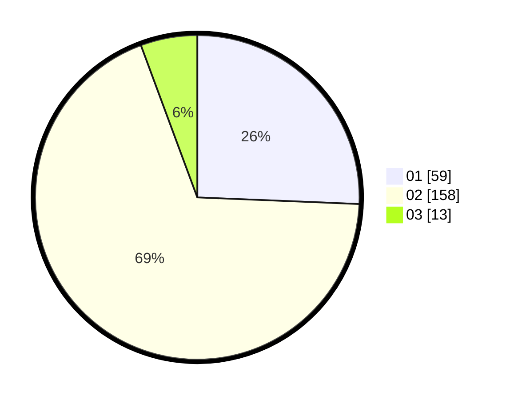

# Hasil

Hasil perolehan suara paslon dapat dilihat pada file paslon-01.txt, paslon-02.txt, dan paslon-03.txt.

Jika tidak ada, artinya data tersebut belum ada pada SIREKAP.

## Perolehan Suara

 * Paslon 01: **59**.
 * Paslon 02: **158**.
 * Paslon 03: **13**.

## Foto C Plano

https://sirekap-obj-formc.kpu.go.id/f90c/pemilu/ppwp/31/73/01/10/05/3173011005310-20240215-011712--973adda7-04c1-48c9-9b04-a08019d3e07c.jpg

https://sirekap-obj-formc.kpu.go.id/f90c/pemilu/ppwp/31/73/01/10/05/3173011005310-20240215-124047--aa0e0283-fe62-4ca8-89e6-b312abdbf492.jpg

https://sirekap-obj-formc.kpu.go.id/f90c/pemilu/ppwp/31/73/01/10/05/3173011005310-20240215-124229--5356a916-8297-4779-a684-2904cc37cc4e.jpg
