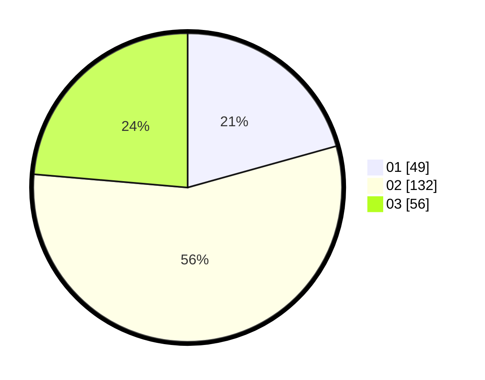

# Hasil

Hasil perolehan suara paslon dapat dilihat pada file paslon-01.txt, paslon-02.txt, dan paslon-03.txt.

Jika tidak ada, artinya data tersebut belum ada pada SIREKAP.

## Perolehan Suara

 * Paslon 01: **49**.
 * Paslon 02: **132**.
 * Paslon 03: **56**.

## Foto C Plano

https://sirekap-obj-formc.kpu.go.id/eca1/pemilu/ppwp/31/73/01/10/05/3173011005311-20240214-155510--7b809de5-a8c0-44d6-8eae-3d25b9a5806e.jpg

https://sirekap-obj-formc.kpu.go.id/eca1/pemilu/ppwp/31/73/01/10/05/3173011005311-20240214-160058--24849737-ff81-4eb8-81c3-ace5960546c8.jpg

https://sirekap-obj-formc.kpu.go.id/eca1/pemilu/ppwp/31/73/01/10/05/3173011005311-20240214-155746--5cf87ea8-1f8e-4538-a5ab-87c6576152c8.jpg
