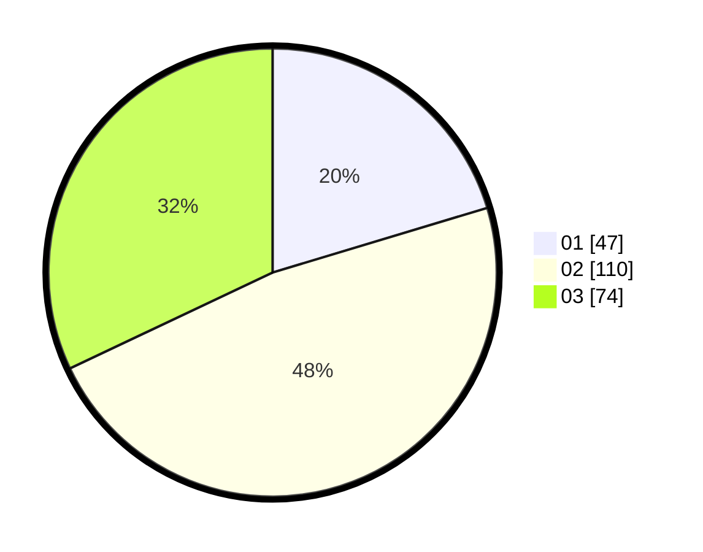

# Hasil

Hasil perolehan suara paslon dapat dilihat pada file paslon-01.txt, paslon-02.txt, dan paslon-03.txt.

Jika tidak ada, artinya data tersebut belum ada pada SIREKAP.

## Perolehan Suara

 * Paslon 01: **47**.
 * Paslon 02: **110**.
 * Paslon 03: **74**.

## Foto C Plano

https://sirekap-obj-formc.kpu.go.id/f7f4/pemilu/ppwp/31/73/01/10/05/3173011005312-20240215-024340--6d8f3a83-5e69-4e8f-9c85-23e8642eef13.jpg

https://sirekap-obj-formc.kpu.go.id/f7f4/pemilu/ppwp/31/73/01/10/05/3173011005312-20240215-024533--c6c2757c-944f-4182-ab49-4552ecb59318.jpg

https://sirekap-obj-formc.kpu.go.id/f7f4/pemilu/ppwp/31/73/01/10/05/3173011005312-20240215-025042--8afeee0d-2e3f-493b-8584-5060fa75a5b6.jpg
