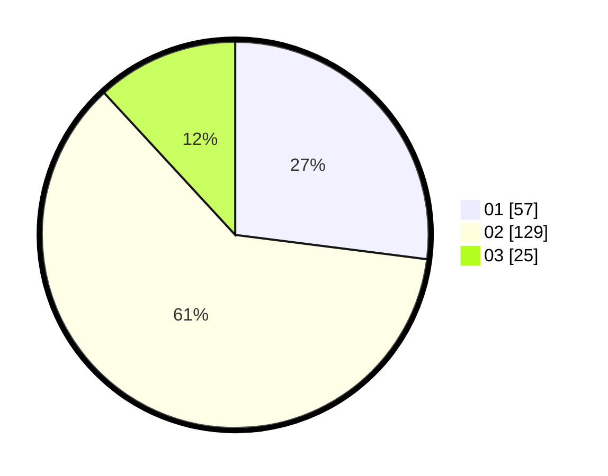

# Hasil

Hasil perolehan suara paslon dapat dilihat pada file paslon-01.txt, paslon-02.txt, dan paslon-03.txt.

Jika tidak ada, artinya data tersebut belum ada pada SIREKAP.

## Perolehan Suara

 * Paslon 01: **57**.
 * Paslon 02: **129**.
 * Paslon 03: **25**.

## Foto C Plano

https://sirekap-obj-formc.kpu.go.id/0e78/pemilu/ppwp/31/73/01/10/05/3173011005315-20240215-020059--fcee5bfe-1201-4c03-9713-0d576e3ffa64.jpg

https://sirekap-obj-formc.kpu.go.id/0e78/pemilu/ppwp/31/73/01/10/05/3173011005315-20240215-020225--e3ebdf1c-18c7-4080-b2e7-14baf3b9901b.jpg

https://sirekap-obj-formc.kpu.go.id/0e78/pemilu/ppwp/31/73/01/10/05/3173011005315-20240215-021451--9bb92484-f64d-435f-a478-5762c050bcff.jpg
