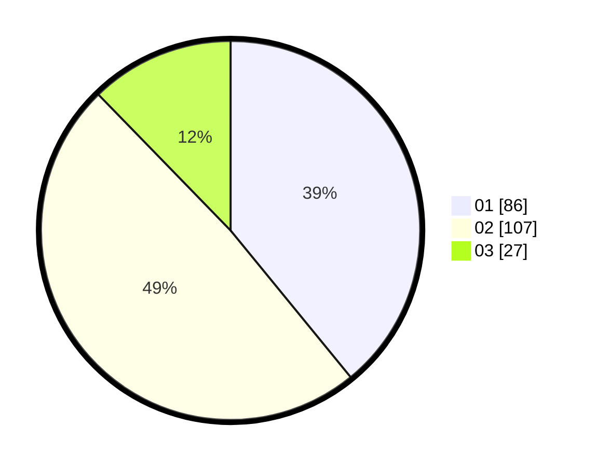

# Hasil

Hasil perolehan suara paslon dapat dilihat pada file paslon-01.txt, paslon-02.txt, dan paslon-03.txt.

Jika tidak ada, artinya data tersebut belum ada pada SIREKAP.

## Perolehan Suara

 * Paslon 01: **86**.
 * Paslon 02: **107**.
 * Paslon 03: **27**.

## Foto C Plano

https://sirekap-obj-formc.kpu.go.id/217d/pemilu/ppwp/31/73/01/10/05/3173011005318-20240214-191107--98f24538-f7ba-4ea8-9b54-5048bb8c1d4f.jpg

https://sirekap-obj-formc.kpu.go.id/217d/pemilu/ppwp/31/73/01/10/05/3173011005318-20240214-192823--462df8f0-7d7b-44f1-9aa2-3eecf66bc5a9.jpg

https://sirekap-obj-formc.kpu.go.id/217d/pemilu/ppwp/31/73/01/10/05/3173011005318-20240214-192354--20b6d613-36e5-45b6-b9fe-42f02f99b305.jpg

## DATA PEMILIH TETAP

Jumlah pemilih dalam DPT: **287**.
 * L: **155**.
 * P: **132**.

## DATA PENGGUNA HAK PILIH

Jumlah pengguna hak pilih dalam DPT: **224**.
 * L: **115**.
 * P: **109**.

Jumlah pengguna hak pilih dalam DPTb: **0**.
 * L: **0**.
 * P: **0**.

Jumlah pengguna hak pilih dalam DPK: **0**.
 * L: **0**.
 * P: **0**.

Jumlah pengguna hak pilih: **224**.
 * L: **115**.
 * P: **109**.

## JUMLAH SUARA SAH DAN TIDAK SAH

JUMLAH SELURUH SUARA SAH: **220**.

JUMLAH SUARA TIDAK SAH: **4**.

JUMLAH SELURUH SUARA SAH DAN SUARA TIDAK SAH: **224**.
