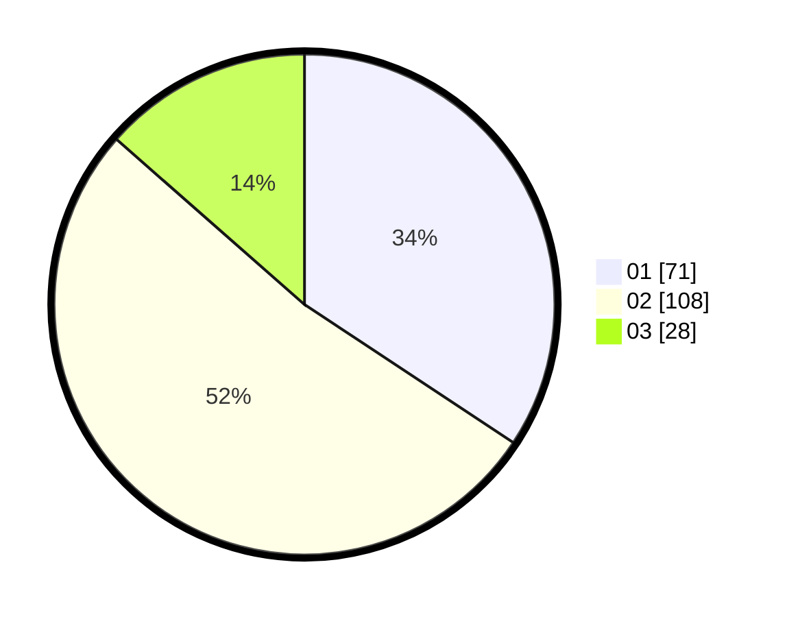

# Hasil

Hasil perolehan suara paslon dapat dilihat pada file paslon-01.txt, paslon-02.txt, dan paslon-03.txt.

Jika tidak ada, artinya data tersebut belum ada pada SIREKAP.

## Perolehan Suara

 * Paslon 01: **71**.
 * Paslon 02: **108**.
 * Paslon 03: **28**.

## Foto C Plano

https://sirekap-obj-formc.kpu.go.id/b920/pemilu/ppwp/31/73/01/10/05/3173011005323-20240214-233508--019250c2-d80d-473c-bc1b-dd8ba3b93a02.jpg

https://sirekap-obj-formc.kpu.go.id/b920/pemilu/ppwp/31/73/01/10/05/3173011005323-20240214-233555--dc2096d2-9ed4-4d5c-a400-a80656f03b63.jpg

https://sirekap-obj-formc.kpu.go.id/b920/pemilu/ppwp/31/73/01/10/05/3173011005323-20240214-233650--dbcf4870-14e9-43ba-b40d-5e1e8c2fbfd9.jpg
