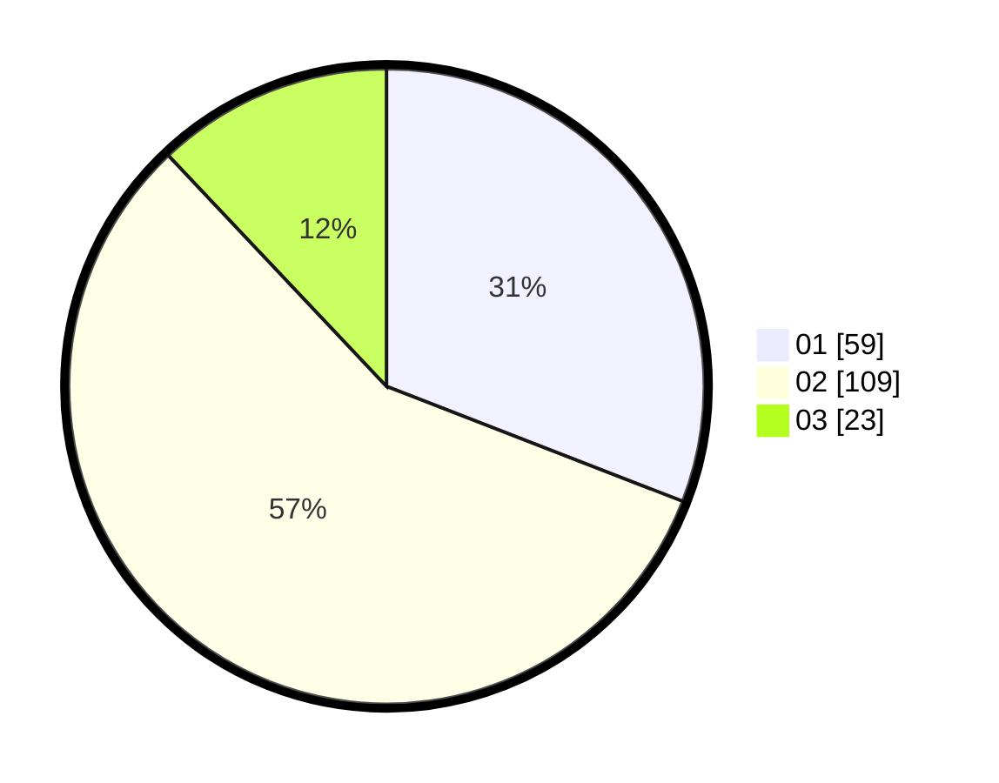

# Hasil

Hasil perolehan suara paslon dapat dilihat pada file paslon-01.txt, paslon-02.txt, dan paslon-03.txt.

Jika tidak ada, artinya data tersebut belum ada pada SIREKAP.

## Perolehan Suara

 * Paslon 01: **59**.
 * Paslon 02: **109**.
 * Paslon 03: **23**.

## Foto C Plano

https://sirekap-obj-formc.kpu.go.id/b060/pemilu/ppwp/31/73/01/10/05/3173011005326-20240214-204812--ad06602e-3d05-4265-b91e-420280acae94.jpg

https://sirekap-obj-formc.kpu.go.id/b060/pemilu/ppwp/31/73/01/10/05/3173011005326-20240214-204847--c0dcd3f6-a273-45d4-a169-32aa93d42b6e.jpg

https://sirekap-obj-formc.kpu.go.id/b060/pemilu/ppwp/31/73/01/10/05/3173011005326-20240215-000430--abe7ebc0-e106-4d6e-addc-caa92be4f4a9.jpg
