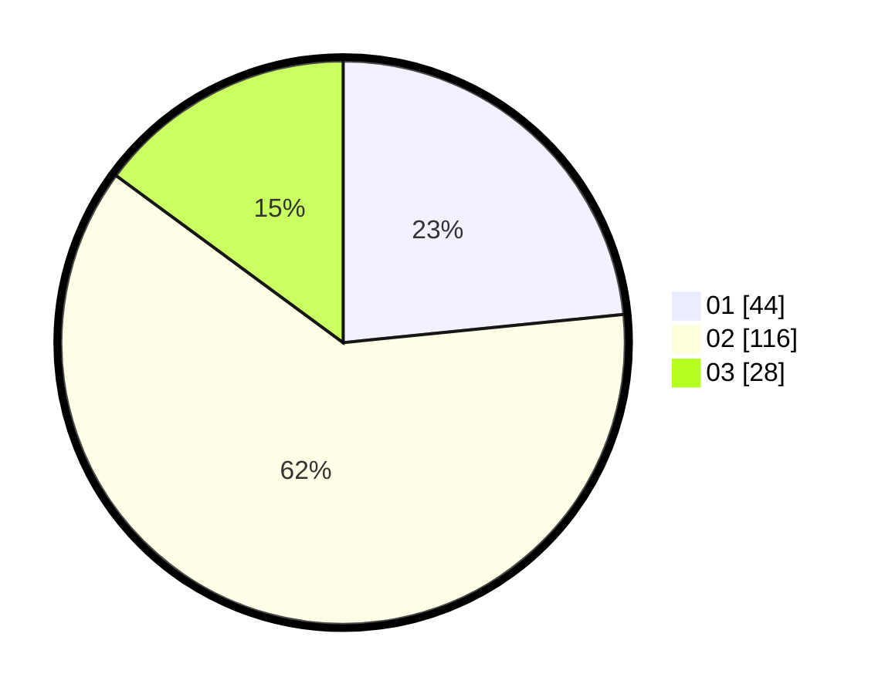

# Hasil

Hasil perolehan suara paslon dapat dilihat pada file paslon-01.txt, paslon-02.txt, dan paslon-03.txt.

Jika tidak ada, artinya data tersebut belum ada pada SIREKAP.

## Perolehan Suara

 * Paslon 01: **44**.
 * Paslon 02: **116**.
 * Paslon 03: **28**.

## Foto C Plano

https://sirekap-obj-formc.kpu.go.id/2e10/pemilu/ppwp/31/73/01/10/05/3173011005327-20240214-224315--d135d450-2148-4cb2-b566-ccb3deb9fe6d.jpg

https://sirekap-obj-formc.kpu.go.id/2e10/pemilu/ppwp/31/73/01/10/05/3173011005327-20240214-222936--359691b2-6bdb-4b91-b822-dc3603f02173.jpg

https://sirekap-obj-formc.kpu.go.id/2e10/pemilu/ppwp/31/73/01/10/05/3173011005327-20240214-224453--16b0e82a-f8d1-4901-9a94-28c416fe512a.jpg

## DATA PEMILIH TETAP

Jumlah pemilih dalam DPT: **299**.
 * L: **152**.
 * P: **147**.

## DATA PENGGUNA HAK PILIH

Jumlah pengguna hak pilih dalam DPT: **192**.
 * L: **91**.
 * P: **101**.

Jumlah pengguna hak pilih dalam DPTb: **0**.
 * L: **0**.
 * P: **0**.

Jumlah pengguna hak pilih dalam DPK: **2**.
 * L: **1**.
 * P: **1**.

Jumlah pengguna hak pilih: **194**.
 * L: **892**.
 * P: **102**.

## JUMLAH SUARA SAH DAN TIDAK SAH

JUMLAH SELURUH SUARA SAH: **188**.

JUMLAH SUARA TIDAK SAH: **6**.

JUMLAH SELURUH SUARA SAH DAN SUARA TIDAK SAH: **194**.
