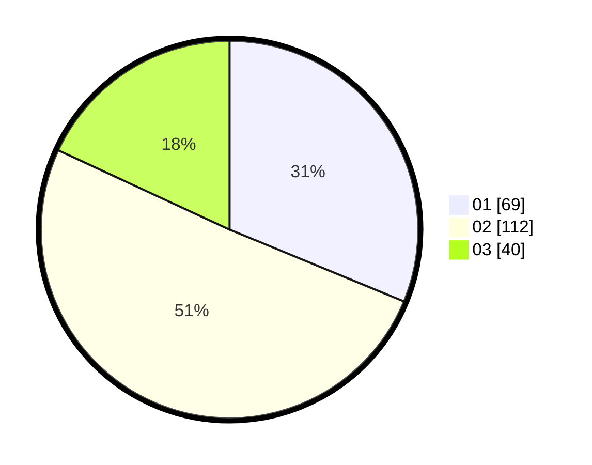

# Hasil

Hasil perolehan suara paslon dapat dilihat pada file paslon-01.txt, paslon-02.txt, dan paslon-03.txt.

Jika tidak ada, artinya data tersebut belum ada pada SIREKAP.

## Perolehan Suara

 * Paslon 01: **69**.
 * Paslon 02: **112**.
 * Paslon 03: **40**.

## Foto C Plano

https://sirekap-obj-formc.kpu.go.id/dfef/pemilu/ppwp/31/73/01/10/05/3173011005331-20240215-211255--6f23432b-aefe-4a59-9dea-5315e158770c.jpg

https://sirekap-obj-formc.kpu.go.id/dfef/pemilu/ppwp/31/73/01/10/05/3173011005331-20240215-211257--a3197d5f-0724-4483-aab3-7c7017ec0249.jpg

https://sirekap-obj-formc.kpu.go.id/dfef/pemilu/ppwp/31/73/01/10/05/3173011005331-20240215-211256--4d88b867-3ee1-48a1-99c0-9809a04d838a.jpg

## DATA PEMILIH TETAP

Jumlah pemilih dalam DPT: **292**.
 * L: **139**.
 * P: **153**.

## DATA PENGGUNA HAK PILIH

Jumlah pengguna hak pilih dalam DPT: **224**.
 * L: **105**.
 * P: **119**.

Jumlah pengguna hak pilih dalam DPTb: **0**.
 * L: **0**.
 * P: **0**.

Jumlah pengguna hak pilih dalam DPK: **2**.
 * L: **2**.
 * P: **0**.

Jumlah pengguna hak pilih: **226**.
 * L: **107**.
 * P: **119**.

## JUMLAH SUARA SAH DAN TIDAK SAH

JUMLAH SELURUH SUARA SAH: **221**.

JUMLAH SUARA TIDAK SAH: **5**.

JUMLAH SELURUH SUARA SAH DAN SUARA TIDAK SAH: **226**.
