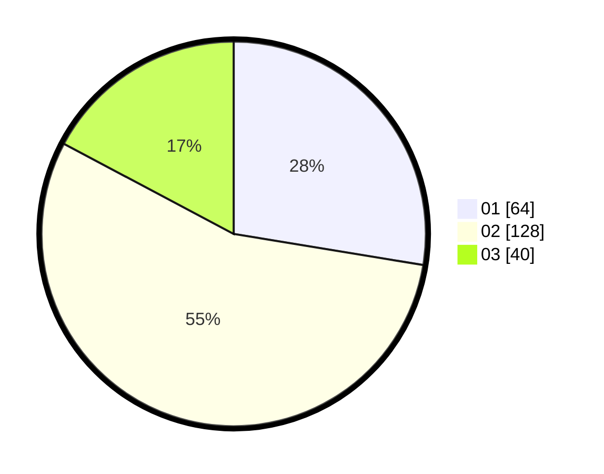

# Hasil

Hasil perolehan suara paslon dapat dilihat pada file paslon-01.txt, paslon-02.txt, dan paslon-03.txt.

Jika tidak ada, artinya data tersebut belum ada pada SIREKAP.

## Perolehan Suara

 * Paslon 01: **64**.
 * Paslon 02: **128**.
 * Paslon 03: **40**.

## Foto C Plano

https://sirekap-obj-formc.kpu.go.id/0c1e/pemilu/ppwp/31/73/01/10/05/3173011005332-20240214-202548--c5a8da58-62b5-4a48-a2b2-a4561df0357b.jpg

https://sirekap-obj-formc.kpu.go.id/0c1e/pemilu/ppwp/31/73/01/10/05/3173011005332-20240214-202704--93f5a90b-75f9-4342-82af-ec6a398312fb.jpg

https://sirekap-obj-formc.kpu.go.id/0c1e/pemilu/ppwp/31/73/01/10/05/3173011005332-20240214-202825--39441c8a-1107-4fbb-b515-dffc0e85a52b.jpg
