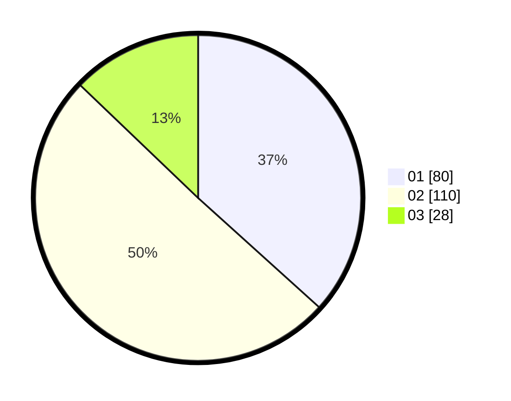

# Hasil

Hasil perolehan suara paslon dapat dilihat pada file paslon-01.txt, paslon-02.txt, dan paslon-03.txt.

Jika tidak ada, artinya data tersebut belum ada pada SIREKAP.

## Perolehan Suara

 * Paslon 01: **80**.
 * Paslon 02: **110**.
 * Paslon 03: **28**.

## Foto C Plano

https://sirekap-obj-formc.kpu.go.id/db6c/pemilu/ppwp/31/73/01/10/05/3173011005334-20240214-211340--116fe019-a2a0-4601-a4d7-fd42bd5fd3dd.jpg

https://sirekap-obj-formc.kpu.go.id/db6c/pemilu/ppwp/31/73/01/10/05/3173011005334-20240214-211512--e0e9eda3-f3ae-4e8f-aac1-ed23fcec44bb.jpg

https://sirekap-obj-formc.kpu.go.id/db6c/pemilu/ppwp/31/73/01/10/05/3173011005334-20240214-211633--bd9a5f35-eb09-4dd1-b29c-f9818a80b4c1.jpg
