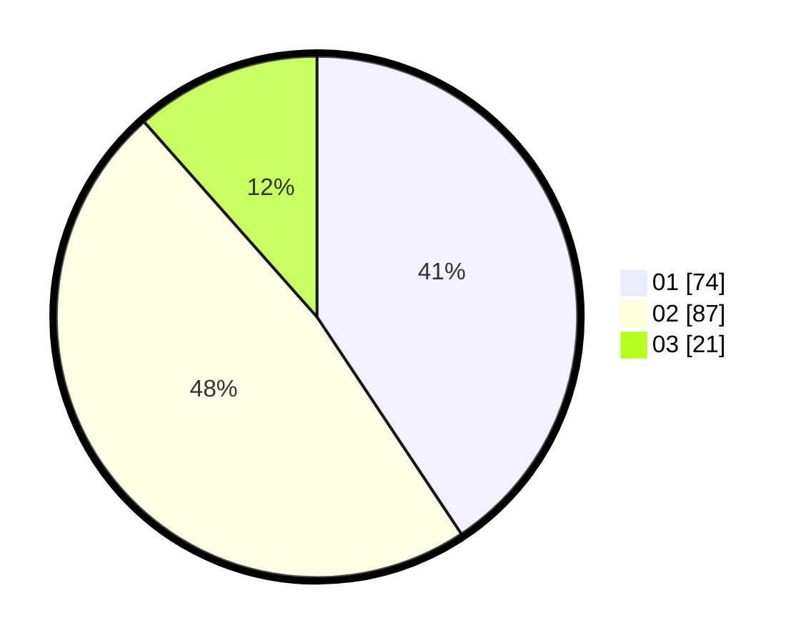

# Hasil

Hasil perolehan suara paslon dapat dilihat pada file paslon-01.txt, paslon-02.txt, dan paslon-03.txt.

Jika tidak ada, artinya data tersebut belum ada pada SIREKAP.

## Perolehan Suara

 * Paslon 01: **74**.
 * Paslon 02: **87**.
 * Paslon 03: **21**.

## Foto C Plano

https://sirekap-obj-formc.kpu.go.id/3155/pemilu/ppwp/31/73/01/10/05/3173011005337-20240216-073153--d815d972-8ef8-4dab-8f31-c440ed9216e4.jpg

https://sirekap-obj-formc.kpu.go.id/3155/pemilu/ppwp/31/73/01/10/05/3173011005337-20240216-073154--03db67c6-44ee-4262-9931-fec4681efcbd.jpg

https://sirekap-obj-formc.kpu.go.id/3155/pemilu/ppwp/31/73/01/10/05/3173011005337-20240216-073153--68e3d17a-6ee3-44b5-840e-685319d8b4e5.jpg

## DATA PEMILIH TETAP

Jumlah pemilih dalam DPT: **270**.
 * L: **138**.
 * P: **132**.

## DATA PENGGUNA HAK PILIH

Jumlah pengguna hak pilih dalam DPT: **186**.
 * L: **90**.
 * P: **96**.

Jumlah pengguna hak pilih dalam DPTb: **0**.
 * L: **0**.
 * P: **0**.

Jumlah pengguna hak pilih dalam DPK: **0**.
 * L: **0**.
 * P: **0**.

Jumlah pengguna hak pilih: **186**.
 * L: **90**.
 * P: **96**.

## JUMLAH SUARA SAH DAN TIDAK SAH

JUMLAH SELURUH SUARA SAH: **182**.

JUMLAH SUARA TIDAK SAH: **4**.

JUMLAH SELURUH SUARA SAH DAN SUARA TIDAK SAH: **186**.
