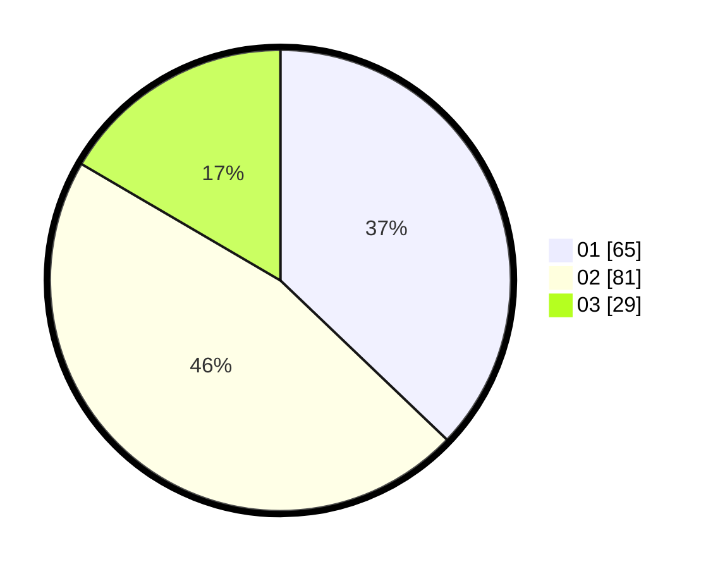

# Hasil

Hasil perolehan suara paslon dapat dilihat pada file paslon-01.txt, paslon-02.txt, dan paslon-03.txt.

Jika tidak ada, artinya data tersebut belum ada pada SIREKAP.

## Perolehan Suara

 * Paslon 01: **65**.
 * Paslon 02: **81**.
 * Paslon 03: **29**.

## Foto C Plano

https://sirekap-obj-formc.kpu.go.id/7570/pemilu/ppwp/31/73/01/10/05/3173011005338-20240214-185633--b763d3d6-9c18-4c14-ab0f-185b5d075720.jpg

https://sirekap-obj-formc.kpu.go.id/7570/pemilu/ppwp/31/73/01/10/05/3173011005338-20240214-190529--ca23aedd-231d-4b30-aced-35e205f99119.jpg

https://sirekap-obj-formc.kpu.go.id/7570/pemilu/ppwp/31/73/01/10/05/3173011005338-20240214-190743--0284e2fc-fb42-4371-ad90-a5eab8868074.jpg

## DATA PEMILIH TETAP

Jumlah pemilih dalam DPT: **266**.
 * L: **134**.
 * P: **132**.

## DATA PENGGUNA HAK PILIH

Jumlah pengguna hak pilih dalam DPT: **178**.
 * L: **87**.
 * P: **91**.

Jumlah pengguna hak pilih dalam DPTb: **0**.
 * L: **0**.
 * P: **0**.

Jumlah pengguna hak pilih dalam DPK: **0**.
 * L: **0**.
 * P: **0**.

Jumlah pengguna hak pilih: **178**.
 * L: **87**.
 * P: **91**.

## JUMLAH SUARA SAH DAN TIDAK SAH

JUMLAH SELURUH SUARA SAH: **175**.

JUMLAH SUARA TIDAK SAH: **3**.

JUMLAH SELURUH SUARA SAH DAN SUARA TIDAK SAH: **178**.
