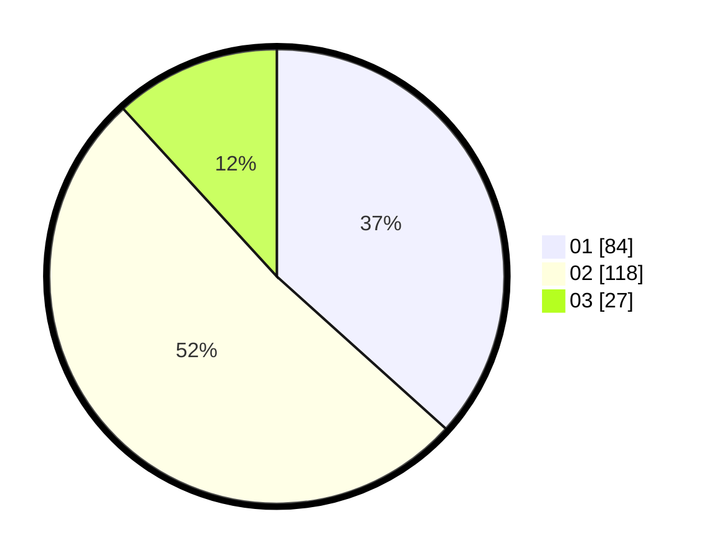

# Hasil

Hasil perolehan suara paslon dapat dilihat pada file paslon-01.txt, paslon-02.txt, dan paslon-03.txt.

Jika tidak ada, artinya data tersebut belum ada pada SIREKAP.

## Perolehan Suara

 * Paslon 01: **84**.
 * Paslon 02: **118**.
 * Paslon 03: **27**.

## Foto C Plano

https://sirekap-obj-formc.kpu.go.id/7912/pemilu/ppwp/31/73/01/10/05/3173011005341-20240214-235427--77f8357e-e541-44df-bfee-81b4c0f85758.jpg

https://sirekap-obj-formc.kpu.go.id/7912/pemilu/ppwp/31/73/01/10/05/3173011005341-20240214-235652--291713eb-303c-4c18-836f-f2b362157995.jpg

https://sirekap-obj-formc.kpu.go.id/7912/pemilu/ppwp/31/73/01/10/05/3173011005341-20240214-235913--325f4d41-a502-4f78-85f8-5d3ae1542ff5.jpg
