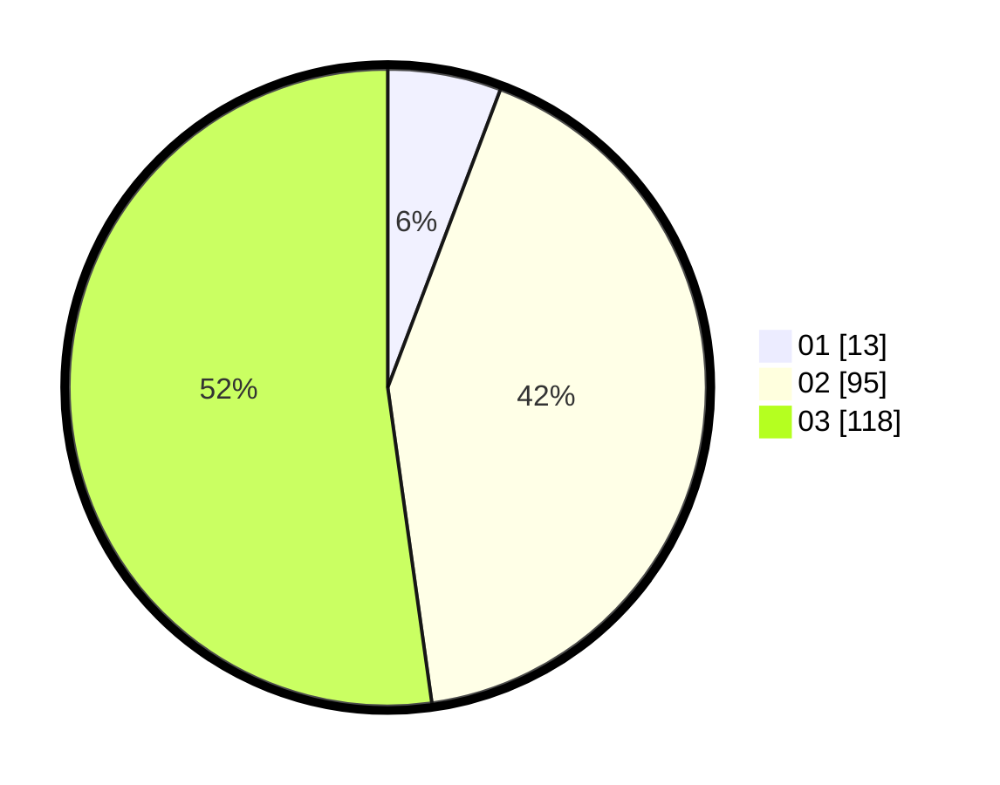

# Hasil

Hasil perolehan suara paslon dapat dilihat pada file paslon-01.txt, paslon-02.txt, dan paslon-03.txt.

Jika tidak ada, artinya data tersebut belum ada pada SIREKAP.

## Perolehan Suara

 * Paslon 01: **13**.
 * Paslon 02: **95**.
 * Paslon 03: **118**.

## Foto C Plano

https://sirekap-obj-formc.kpu.go.id/6bbd/pemilu/ppwp/31/73/01/10/05/3173011005349-20240216-071023--7c05cec9-0805-4db5-a55c-a01f9f05217f.jpg

https://sirekap-obj-formc.kpu.go.id/6bbd/pemilu/ppwp/31/73/01/10/05/3173011005349-20240216-071024--b484b9ec-3e67-4111-b9ed-31fb8a97f668.jpg

https://sirekap-obj-formc.kpu.go.id/6bbd/pemilu/ppwp/31/73/01/10/05/3173011005349-20240216-071024--2d676923-5b4f-497c-bfec-50502e58a039.jpg

## DATA PEMILIH TETAP

Jumlah pemilih dalam DPT: **273**.
 * L: **127**.
 * P: **146**.

## DATA PENGGUNA HAK PILIH

Jumlah pengguna hak pilih dalam DPT: **213**.
 * L: **94**.
 * P: **119**.

Jumlah pengguna hak pilih dalam DPTb: **7**.
 * L: **5**.
 * P: **2**.

Jumlah pengguna hak pilih dalam DPK: **6**.
 * L: **4**.
 * P: **2**.

Jumlah pengguna hak pilih: **226**.
 * L: **103**.
 * P: **123**.

## JUMLAH SUARA SAH DAN TIDAK SAH

JUMLAH SELURUH SUARA SAH: **0**.

JUMLAH SUARA TIDAK SAH: **1**.

JUMLAH SELURUH SUARA SAH DAN SUARA TIDAK SAH: **1**.
