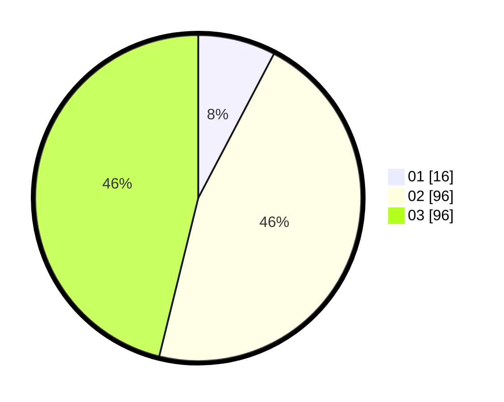

# Hasil

Hasil perolehan suara paslon dapat dilihat pada file paslon-01.txt, paslon-02.txt, dan paslon-03.txt.

Jika tidak ada, artinya data tersebut belum ada pada SIREKAP.

## Perolehan Suara

 * Paslon 01: **16**.
 * Paslon 02: **96**.
 * Paslon 03: **96**.

## Foto C Plano

https://sirekap-obj-formc.kpu.go.id/c174/pemilu/ppwp/31/73/01/10/05/3173011005354-20240216-055551--d6e0471c-f2fc-4daf-aca9-fe85af002994.jpg

https://sirekap-obj-formc.kpu.go.id/c174/pemilu/ppwp/31/73/01/10/05/3173011005354-20240216-055552--0f2dc326-dcd9-4661-9dfa-f19276bbb007.jpg

https://sirekap-obj-formc.kpu.go.id/c174/pemilu/ppwp/31/73/01/10/05/3173011005354-20240216-055551--49857506-5a6a-4562-a5cb-0b7b0a14ff27.jpg

## DATA PEMILIH TETAP

Jumlah pemilih dalam DPT: **269**.
 * L: **125**.
 * P: **144**.

## DATA PENGGUNA HAK PILIH

Jumlah pengguna hak pilih dalam DPT: **205**.
 * L: **94**.
 * P: **111**.

Jumlah pengguna hak pilih dalam DPTb: **1**.
 * L: **0**.
 * P: **1**.

Jumlah pengguna hak pilih dalam DPK: **3**.
 * L: **1**.
 * P: **2**.

Jumlah pengguna hak pilih: **209**.
 * L: **95**.
 * P: **114**.

## JUMLAH SUARA SAH DAN TIDAK SAH

JUMLAH SELURUH SUARA SAH: **208**.

JUMLAH SUARA TIDAK SAH: **1**.

JUMLAH SELURUH SUARA SAH DAN SUARA TIDAK SAH: **209**.
