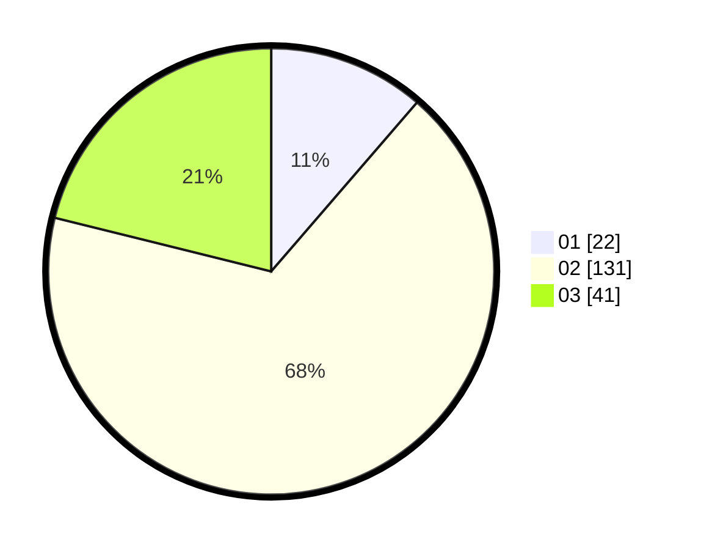

# Hasil

Hasil perolehan suara paslon dapat dilihat pada file paslon-01.txt, paslon-02.txt, dan paslon-03.txt.

Jika tidak ada, artinya data tersebut belum ada pada SIREKAP.

## Perolehan Suara

 * Paslon 01: **22**.
 * Paslon 02: **131**.
 * Paslon 03: **41**.

## Foto C Plano

https://sirekap-obj-formc.kpu.go.id/eb27/pemilu/ppwp/31/73/01/10/05/3173011005356-20240214-234214--937b4d09-51ca-4b58-b958-2545adb43fc3.jpg

https://sirekap-obj-formc.kpu.go.id/eb27/pemilu/ppwp/31/73/01/10/05/3173011005356-20240214-234447--96a83bde-fb93-4304-a222-ab5255c7ef52.jpg

https://sirekap-obj-formc.kpu.go.id/eb27/pemilu/ppwp/31/73/01/10/05/3173011005356-20240214-234552--7a20d1ba-f437-4c50-a0e0-8b2cafa78ec7.jpg
