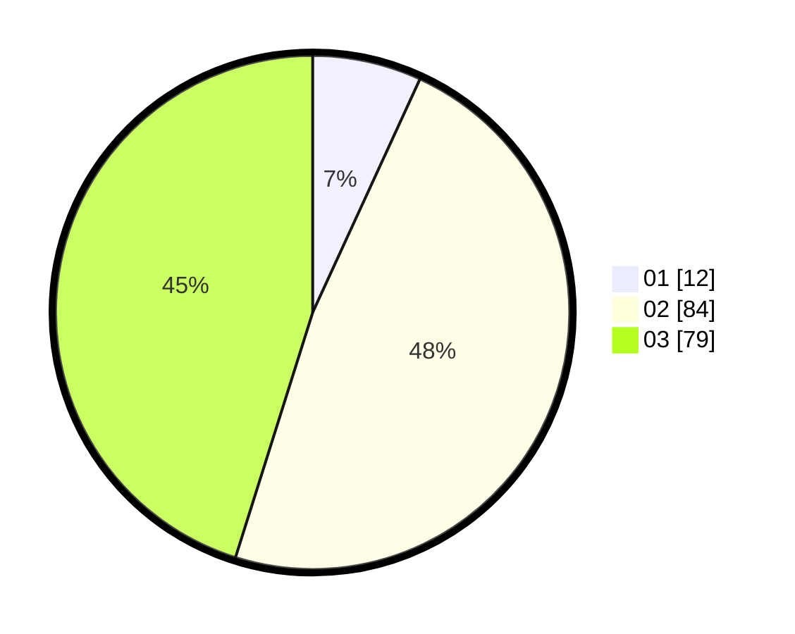

# Hasil

Hasil perolehan suara paslon dapat dilihat pada file paslon-01.txt, paslon-02.txt, dan paslon-03.txt.

Jika tidak ada, artinya data tersebut belum ada pada SIREKAP.

## Perolehan Suara

 * Paslon 01: **12**.
 * Paslon 02: **84**.
 * Paslon 03: **79**.

## Foto C Plano

https://sirekap-obj-formc.kpu.go.id/39d0/pemilu/ppwp/31/73/01/10/05/3173011005359-20240216-012803--882ad258-1eb9-46a2-b358-6a179d3ab445.jpg

https://sirekap-obj-formc.kpu.go.id/39d0/pemilu/ppwp/31/73/01/10/05/3173011005359-20240216-023532--50427cd7-6771-4daa-9b89-47cf3ca1fee8.jpg

https://sirekap-obj-formc.kpu.go.id/39d0/pemilu/ppwp/31/73/01/10/05/3173011005359-20240216-012808--c1f7c0e3-4cb0-454c-8c76-e043c5ba728a.jpg

## DATA PEMILIH TETAP

Jumlah pemilih dalam DPT: **235**.
 * L: **111**.
 * P: **124**.

## DATA PENGGUNA HAK PILIH

Jumlah pengguna hak pilih dalam DPT: **171**.
 * L: **81**.
 * P: **90**.

Jumlah pengguna hak pilih dalam DPTb: **3**.
 * L: **0**.
 * P: **3**.

Jumlah pengguna hak pilih dalam DPK: **1**.
 * L: **1**.
 * P: **0**.

Jumlah pengguna hak pilih: **175**.
 * L: **82**.
 * P: **93**.

## JUMLAH SUARA SAH DAN TIDAK SAH

JUMLAH SELURUH SUARA SAH: **175**.

JUMLAH SUARA TIDAK SAH: **0**.

JUMLAH SELURUH SUARA SAH DAN SUARA TIDAK SAH: **175**.
