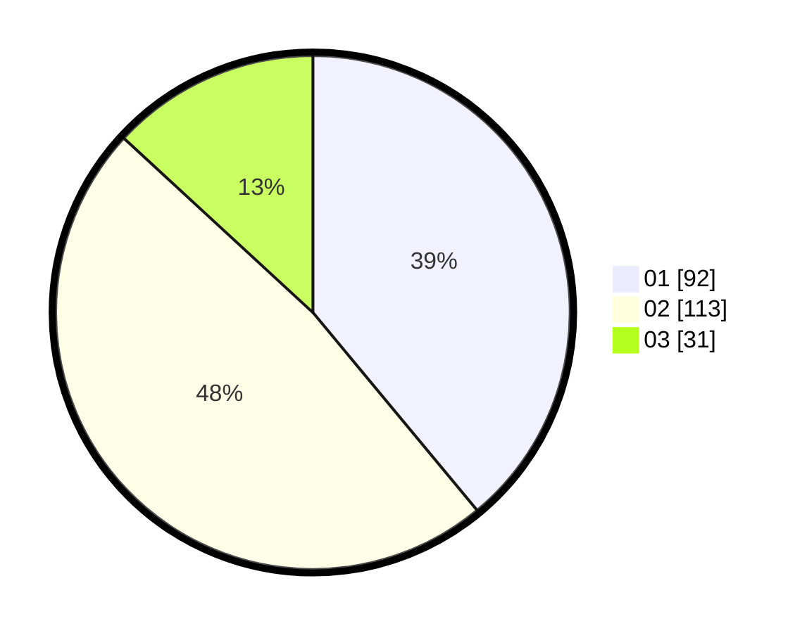

# Hasil

Hasil perolehan suara paslon dapat dilihat pada file paslon-01.txt, paslon-02.txt, dan paslon-03.txt.

Jika tidak ada, artinya data tersebut belum ada pada SIREKAP.

## Perolehan Suara

 * Paslon 01: **92**.
 * Paslon 02: **113**.
 * Paslon 03: **31**.

## Foto C Plano

https://sirekap-obj-formc.kpu.go.id/4d01/pemilu/ppwp/31/73/01/10/05/3173011005362-20240216-175808--6428bfb3-513a-4bd7-ab0f-9335a0a1d8ac.jpg

https://sirekap-obj-formc.kpu.go.id/4d01/pemilu/ppwp/31/73/01/10/05/3173011005362-20240216-175809--ead0f294-3901-4add-8a79-3b7e5d229a05.jpg

https://sirekap-obj-formc.kpu.go.id/4d01/pemilu/ppwp/31/73/01/10/05/3173011005362-20240216-175809--151e308a-ff59-46bd-a7a7-e58011f7d14f.jpg

## DATA PEMILIH TETAP

Jumlah pemilih dalam DPT: **285**.
 * L: **144**.
 * P: **141**.

## DATA PENGGUNA HAK PILIH

Jumlah pengguna hak pilih dalam DPT: **236**.
 * L: **119**.
 * P: **117**.

Jumlah pengguna hak pilih dalam DPTb: **4**.
 * L: **3**.
 * P: **1**.

Jumlah pengguna hak pilih dalam DPK: **2**.
 * L: **1**.
 * P: **1**.

Jumlah pengguna hak pilih: **242**.
 * L: **123**.
 * P: **119**.

## JUMLAH SUARA SAH DAN TIDAK SAH

JUMLAH SELURUH SUARA SAH: **236**.

JUMLAH SUARA TIDAK SAH: **6**.

JUMLAH SELURUH SUARA SAH DAN SUARA TIDAK SAH: **242**.
