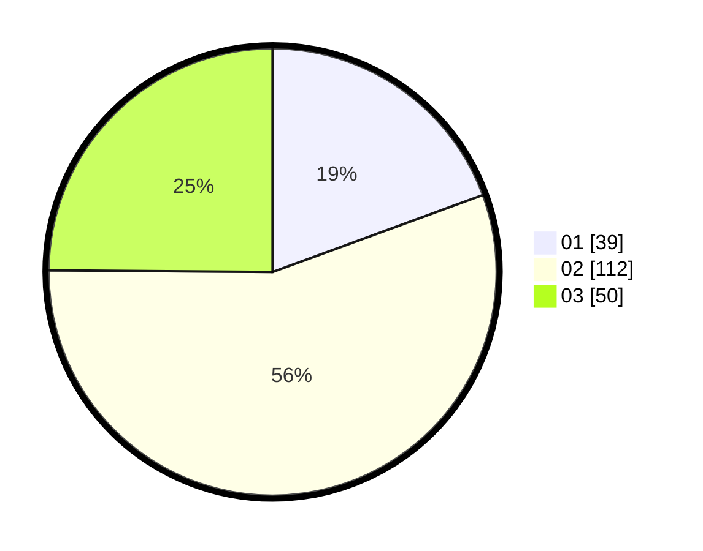

# Hasil

Hasil perolehan suara paslon dapat dilihat pada file paslon-01.txt, paslon-02.txt, dan paslon-03.txt.

Jika tidak ada, artinya data tersebut belum ada pada SIREKAP.

## Perolehan Suara

 * Paslon 01: **39**.
 * Paslon 02: **112**.
 * Paslon 03: **50**.

## Foto C Plano

https://sirekap-obj-formc.kpu.go.id/d76a/pemilu/ppwp/31/73/01/10/05/3173011005366-20240214-230117--12b18abd-94a9-4abf-a24f-6a7be0b0212b.jpg

https://sirekap-obj-formc.kpu.go.id/d76a/pemilu/ppwp/31/73/01/10/05/3173011005366-20240215-025030--2879aa49-6f19-49f5-b2c3-6c390d576bc2.jpg

https://sirekap-obj-formc.kpu.go.id/d76a/pemilu/ppwp/31/73/01/10/05/3173011005366-20240214-230249--b2ce96fc-c775-4708-9765-5d7881e9294f.jpg
