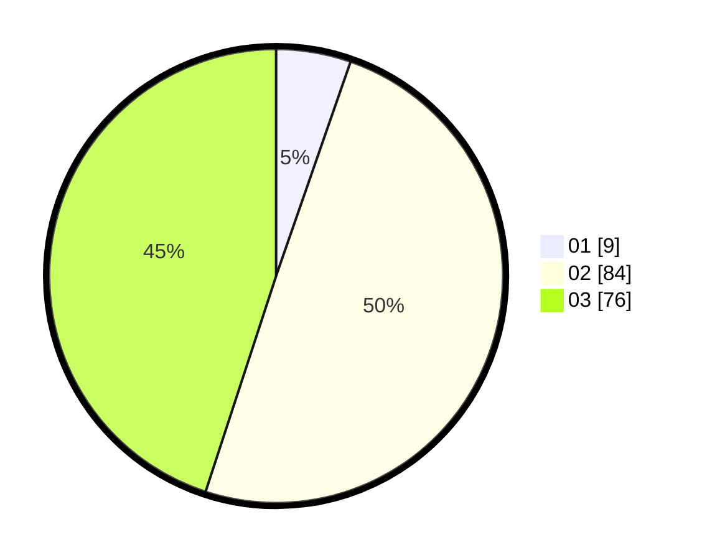

# Hasil

Hasil perolehan suara paslon dapat dilihat pada file paslon-01.txt, paslon-02.txt, dan paslon-03.txt.

Jika tidak ada, artinya data tersebut belum ada pada SIREKAP.

## Perolehan Suara

 * Paslon 01: **9**.
 * Paslon 02: **84**.
 * Paslon 03: **76**.

## Foto C Plano

https://sirekap-obj-formc.kpu.go.id/b5ee/pemilu/ppwp/31/73/01/10/05/3173011005368-20240214-202500--f464ecd7-b50a-4739-87c1-67ff1fdec3b1.jpg

https://sirekap-obj-formc.kpu.go.id/b5ee/pemilu/ppwp/31/73/01/10/05/3173011005368-20240214-202523--8e3ec3a8-0355-4ce1-b426-4e6963d2918a.jpg

https://sirekap-obj-formc.kpu.go.id/b5ee/pemilu/ppwp/31/73/01/10/05/3173011005368-20240214-202537--09552ff5-4563-4a2e-aa59-0a7198c90c7f.jpg
