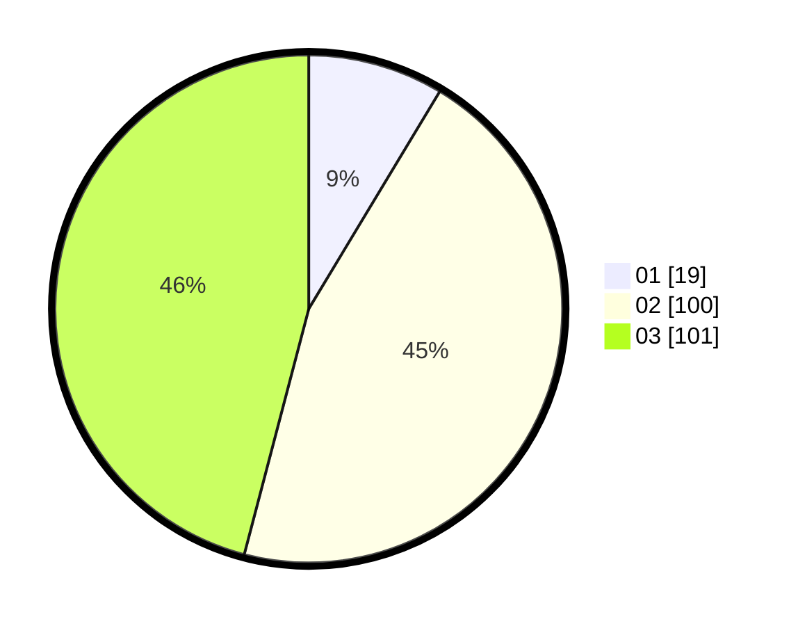

# Hasil

Hasil perolehan suara paslon dapat dilihat pada file paslon-01.txt, paslon-02.txt, dan paslon-03.txt.

Jika tidak ada, artinya data tersebut belum ada pada SIREKAP.

## Perolehan Suara

 * Paslon 01: **19**.
 * Paslon 02: **100**.
 * Paslon 03: **101**.

## Foto C Plano

https://sirekap-obj-formc.kpu.go.id/74e7/pemilu/ppwp/31/73/01/10/05/3173011005369-20240216-063616--f4dc1aed-e29c-463b-b442-d387f61acc76.jpg

https://sirekap-obj-formc.kpu.go.id/74e7/pemilu/ppwp/31/73/01/10/05/3173011005369-20240216-175846--64d7baa8-bd95-4594-81a5-e5ee1d2f1670.jpg

https://sirekap-obj-formc.kpu.go.id/74e7/pemilu/ppwp/31/73/01/10/05/3173011005369-20240216-063618--8573bc2c-c661-47b4-b072-cf3bb7ef7b56.jpg

## DATA PEMILIH TETAP

Jumlah pemilih dalam DPT: **282**.
 * L: **135**.
 * P: **147**.

## DATA PENGGUNA HAK PILIH

Jumlah pengguna hak pilih dalam DPT: **218**.
 * L: **105**.
 * P: **113**.

Jumlah pengguna hak pilih dalam DPTb: **4**.
 * L: **2**.
 * P: **2**.

Jumlah pengguna hak pilih dalam DPK: **3**.
 * L: **0**.
 * P: **3**.

Jumlah pengguna hak pilih: **225**.
 * L: **107**.
 * P: **118**.

## JUMLAH SUARA SAH DAN TIDAK SAH

JUMLAH SELURUH SUARA SAH: **220**.

JUMLAH SUARA TIDAK SAH: **5**.

JUMLAH SELURUH SUARA SAH DAN SUARA TIDAK SAH: **225**.
