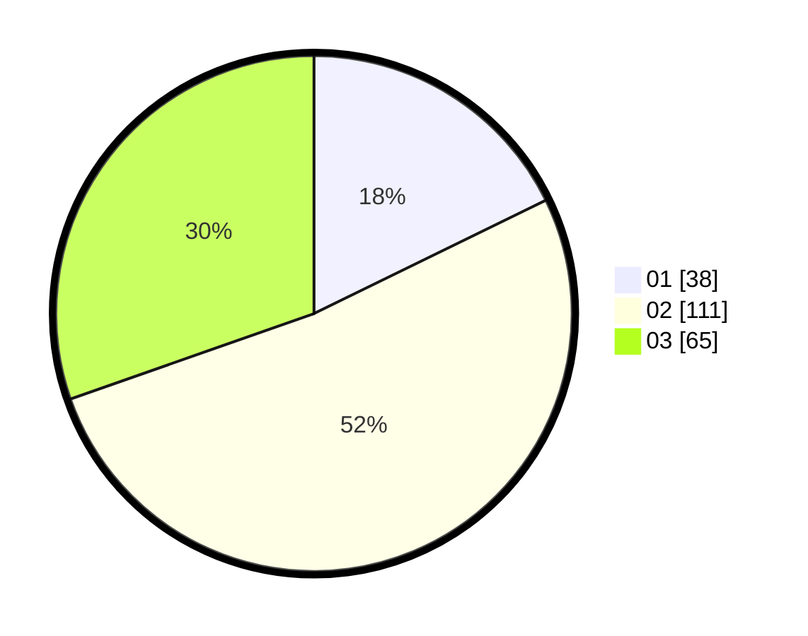

# Hasil

Hasil perolehan suara paslon dapat dilihat pada file paslon-01.txt, paslon-02.txt, dan paslon-03.txt.

Jika tidak ada, artinya data tersebut belum ada pada SIREKAP.

## Perolehan Suara

 * Paslon 01: **38**.
 * Paslon 02: **111**.
 * Paslon 03: **65**.

## Foto C Plano

https://sirekap-obj-formc.kpu.go.id/8e11/pemilu/ppwp/31/73/01/10/05/3173011005372-20240214-232004--9b3274c3-789d-42e2-b6b4-ad50d20f427b.jpg

https://sirekap-obj-formc.kpu.go.id/8e11/pemilu/ppwp/31/73/01/10/05/3173011005372-20240214-232029--b8f5239e-0c6c-4e83-a8cb-38d5a9cc2634.jpg

https://sirekap-obj-formc.kpu.go.id/8e11/pemilu/ppwp/31/73/01/10/05/3173011005372-20240214-232105--495ab275-b3ad-4972-a8b6-b354fa99a61e.jpg
