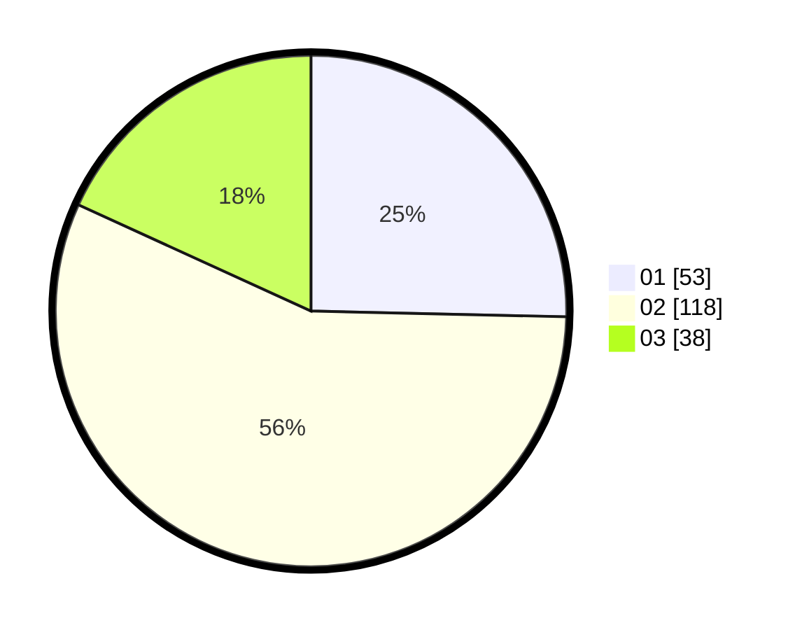

# Hasil

Hasil perolehan suara paslon dapat dilihat pada file paslon-01.txt, paslon-02.txt, dan paslon-03.txt.

Jika tidak ada, artinya data tersebut belum ada pada SIREKAP.

## Perolehan Suara

 * Paslon 01: **53**.
 * Paslon 02: **118**.
 * Paslon 03: **38**.

## Foto C Plano

https://sirekap-obj-formc.kpu.go.id/d469/pemilu/ppwp/31/73/01/10/05/3173011005374-20240215-025404--62937646-c83e-4a26-8d5e-66465295977c.jpg

https://sirekap-obj-formc.kpu.go.id/d469/pemilu/ppwp/31/73/01/10/05/3173011005374-20240215-025618--ceb14195-379e-4085-9f54-dc1020328426.jpg

https://sirekap-obj-formc.kpu.go.id/d469/pemilu/ppwp/31/73/01/10/05/3173011005374-20240215-030039--15b77f6d-44d6-4edf-bc8c-0d70229924b2.jpg
