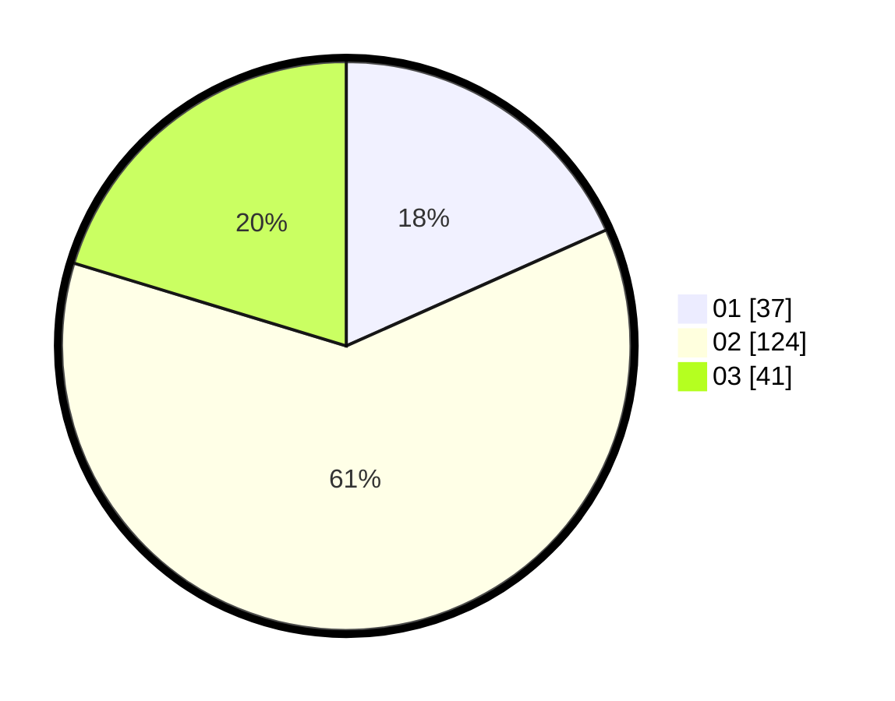

# Hasil

Hasil perolehan suara paslon dapat dilihat pada file paslon-01.txt, paslon-02.txt, dan paslon-03.txt.

Jika tidak ada, artinya data tersebut belum ada pada SIREKAP.

## Perolehan Suara

 * Paslon 01: **37**.
 * Paslon 02: **124**.
 * Paslon 03: **41**.

## Foto C Plano

https://sirekap-obj-formc.kpu.go.id/11cf/pemilu/ppwp/31/73/01/10/05/3173011005375-20240214-230025--0609e130-6e2f-4de3-9c8a-6af341a910b2.jpg

https://sirekap-obj-formc.kpu.go.id/11cf/pemilu/ppwp/31/73/01/10/05/3173011005375-20240214-213812--e14e9369-71fa-4bd2-a88d-8acb4e640d0f.jpg

https://sirekap-obj-formc.kpu.go.id/11cf/pemilu/ppwp/31/73/01/10/05/3173011005375-20240214-213327--69e7f1b1-7f12-4173-a72a-d14e62600399.jpg
