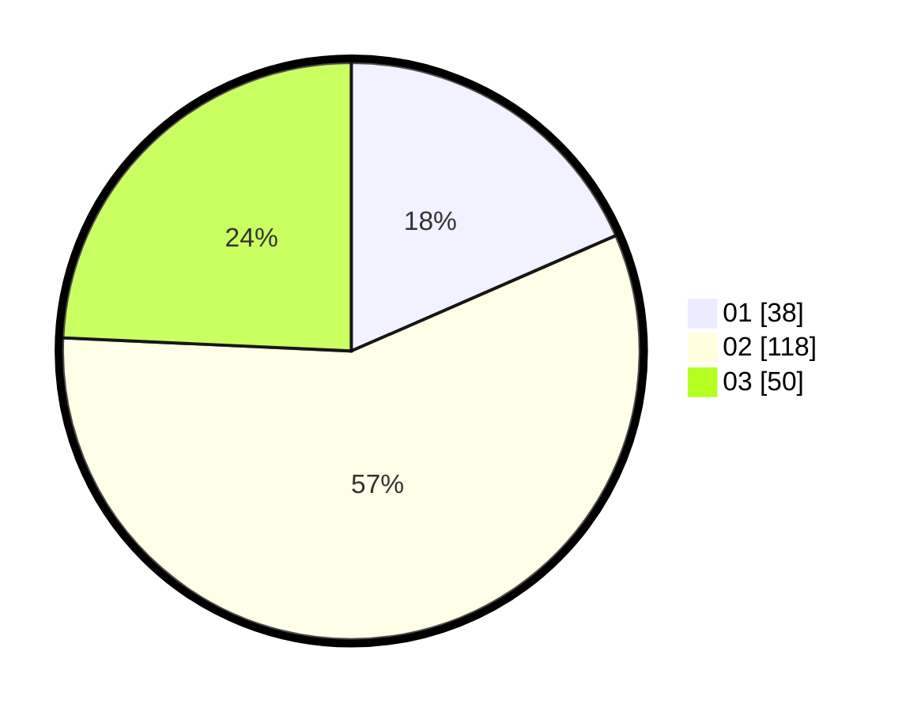

# Hasil

Hasil perolehan suara paslon dapat dilihat pada file paslon-01.txt, paslon-02.txt, dan paslon-03.txt.

Jika tidak ada, artinya data tersebut belum ada pada SIREKAP.

## Perolehan Suara

 * Paslon 01: **38**.
 * Paslon 02: **118**.
 * Paslon 03: **50**.

## Foto C Plano

https://sirekap-obj-formc.kpu.go.id/d827/pemilu/ppwp/31/73/01/10/05/3173011005377-20240217-163138--90c6a79b-b078-4145-a260-0d99996b4a56.jpg

https://sirekap-obj-formc.kpu.go.id/d827/pemilu/ppwp/31/73/01/10/05/3173011005377-20240217-163140--4533af29-a89a-49f7-a28f-e861f1c83eb1.jpg

https://sirekap-obj-formc.kpu.go.id/d827/pemilu/ppwp/31/73/01/10/05/3173011005377-20240217-163139--30abe096-48b1-47df-85f2-e51583ead9e2.jpg

## DATA PEMILIH TETAP

Jumlah pemilih dalam DPT: **262**.
 * L: **136**.
 * P: **126**.

## DATA PENGGUNA HAK PILIH

Jumlah pengguna hak pilih dalam DPT: **209**.
 * L: **107**.
 * P: **102**.

Jumlah pengguna hak pilih dalam DPTb: **0**.
 * L: **0**.
 * P: **0**.

Jumlah pengguna hak pilih dalam DPK: **0**.
 * L: **0**.
 * P: **0**.

Jumlah pengguna hak pilih: **209**.
 * L: **107**.
 * P: **102**.

## JUMLAH SUARA SAH DAN TIDAK SAH

JUMLAH SELURUH SUARA SAH: **206**.

JUMLAH SUARA TIDAK SAH: **3**.

JUMLAH SELURUH SUARA SAH DAN SUARA TIDAK SAH: **209**.
