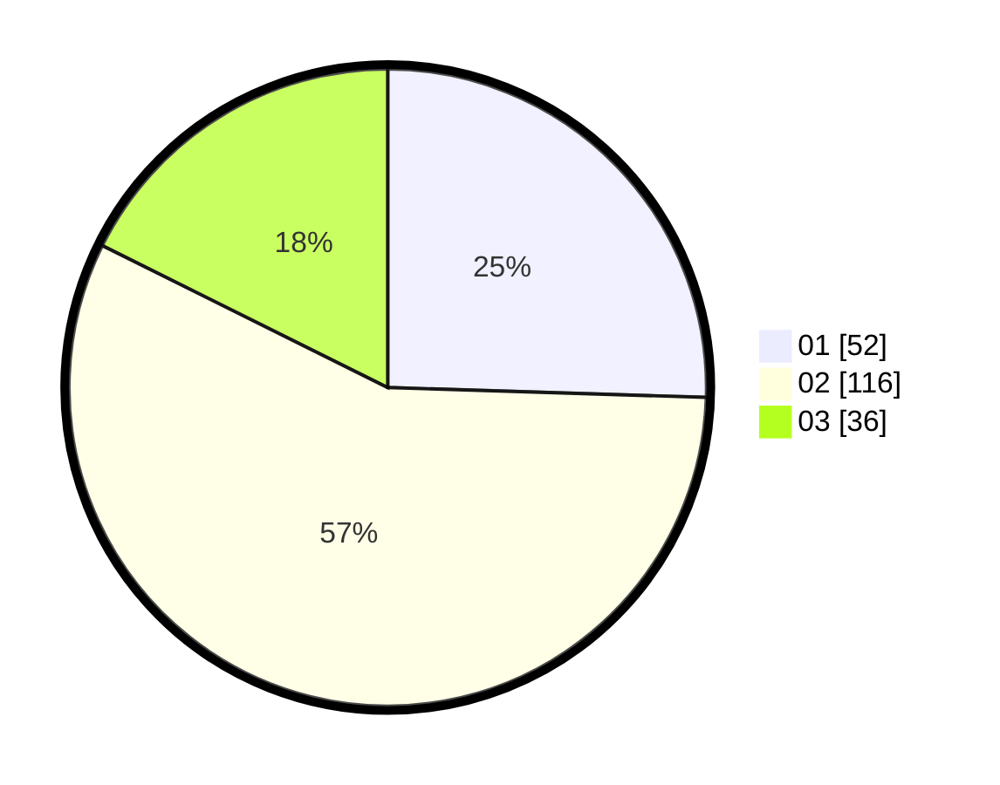

# Hasil

Hasil perolehan suara paslon dapat dilihat pada file paslon-01.txt, paslon-02.txt, dan paslon-03.txt.

Jika tidak ada, artinya data tersebut belum ada pada SIREKAP.

## Perolehan Suara

 * Paslon 01: **52**.
 * Paslon 02: **116**.
 * Paslon 03: **36**.

## Foto C Plano

https://sirekap-obj-formc.kpu.go.id/0de9/pemilu/ppwp/31/73/01/10/05/3173011005378-20240214-225956--63dd52b9-4ea9-4406-b75f-ebeb308e930e.jpg

https://sirekap-obj-formc.kpu.go.id/0de9/pemilu/ppwp/31/73/01/10/05/3173011005378-20240214-230334--f4c148e8-ff8d-44db-8f7e-69eeae814af7.jpg

https://sirekap-obj-formc.kpu.go.id/0de9/pemilu/ppwp/31/73/01/10/05/3173011005378-20240217-060008--dac427e4-b12b-40e1-b534-f2092a591826.jpg

## DATA PEMILIH TETAP

Jumlah pemilih dalam DPT: **257**.
 * L: **127**.
 * P: **130**.

## DATA PENGGUNA HAK PILIH

Jumlah pengguna hak pilih dalam DPT: **206**.
 * L: **95**.
 * P: **111**.

Jumlah pengguna hak pilih dalam DPTb: **0**.
 * L: **0**.
 * P: **0**.

Jumlah pengguna hak pilih dalam DPK: **3**.
 * L: **2**.
 * P: **1**.

Jumlah pengguna hak pilih: **209**.
 * L: **97**.
 * P: **112**.

## JUMLAH SUARA SAH DAN TIDAK SAH

JUMLAH SELURUH SUARA SAH: **204**.

JUMLAH SUARA TIDAK SAH: **3**.

JUMLAH SELURUH SUARA SAH DAN SUARA TIDAK SAH: **207**.
