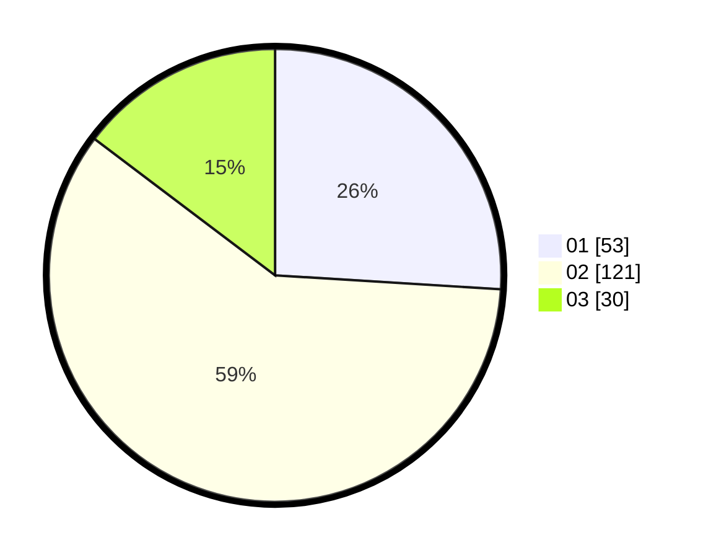

# Hasil

Hasil perolehan suara paslon dapat dilihat pada file paslon-01.txt, paslon-02.txt, dan paslon-03.txt.

Jika tidak ada, artinya data tersebut belum ada pada SIREKAP.

## Perolehan Suara

 * Paslon 01: **53**.
 * Paslon 02: **121**.
 * Paslon 03: **30**.

## Foto C Plano

https://sirekap-obj-formc.kpu.go.id/5344/pemilu/ppwp/31/73/01/10/05/3173011005379-20240215-013724--5dbcd215-f96d-4a17-aa74-5f1b10449ca2.jpg

https://sirekap-obj-formc.kpu.go.id/5344/pemilu/ppwp/31/73/01/10/05/3173011005379-20240215-014335--1f2ae105-a02c-40f1-bd6e-4bbb5a4f1857.jpg

https://sirekap-obj-formc.kpu.go.id/5344/pemilu/ppwp/31/73/01/10/05/3173011005379-20240215-014442--adff172e-cc5c-4690-b189-aff3225226f1.jpg

## DATA PEMILIH TETAP

Jumlah pemilih dalam DPT: **264**.
 * L: **133**.
 * P: **131**.

## DATA PENGGUNA HAK PILIH

Jumlah pengguna hak pilih dalam DPT: **207**.
 * L: **101**.
 * P: **106**.

Jumlah pengguna hak pilih dalam DPTb: **0**.
 * L: **0**.
 * P: **0**.

Jumlah pengguna hak pilih dalam DPK: **2**.
 * L: **1**.
 * P: **1**.

Jumlah pengguna hak pilih: **209**.
 * L: **102**.
 * P: **107**.

## JUMLAH SUARA SAH DAN TIDAK SAH

JUMLAH SELURUH SUARA SAH: **204**.

JUMLAH SUARA TIDAK SAH: **5**.

JUMLAH SELURUH SUARA SAH DAN SUARA TIDAK SAH: **209**.
