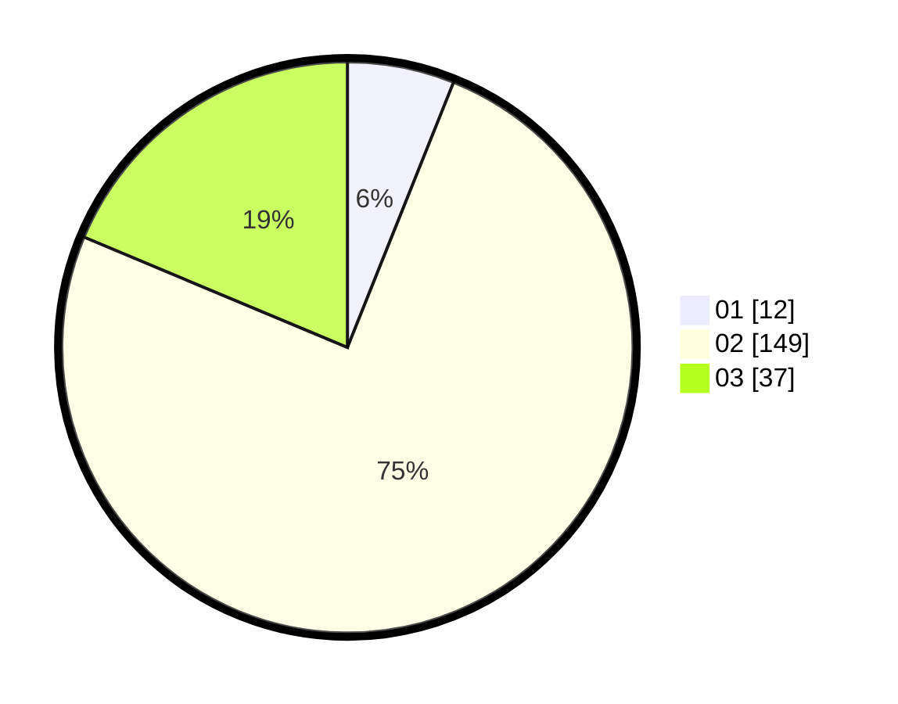

# Hasil

Hasil perolehan suara paslon dapat dilihat pada file paslon-01.txt, paslon-02.txt, dan paslon-03.txt.

Jika tidak ada, artinya data tersebut belum ada pada SIREKAP.

## Perolehan Suara

 * Paslon 01: **12**.
 * Paslon 02: **149**.
 * Paslon 03: **37**.

## Foto C Plano

https://sirekap-obj-formc.kpu.go.id/6e01/pemilu/ppwp/31/73/01/10/05/3173011005382-20240216-022431--1bd2f433-cc00-48b5-aa15-34fb9af8f6da.jpg

https://sirekap-obj-formc.kpu.go.id/6e01/pemilu/ppwp/31/73/01/10/05/3173011005382-20240216-022449--3b655141-b7ec-43a1-9eca-de8d1e0974bb.jpg

https://sirekap-obj-formc.kpu.go.id/6e01/pemilu/ppwp/31/73/01/10/05/3173011005382-20240216-024214--4589b6b1-e0fc-4625-9ed7-2b3470751e0c.jpg

## DATA PEMILIH TETAP

Jumlah pemilih dalam DPT: **268**.
 * L: **138**.
 * P: **130**.

## DATA PENGGUNA HAK PILIH

Jumlah pengguna hak pilih dalam DPT: **201**.
 * L: **104**.
 * P: **97**.

Jumlah pengguna hak pilih dalam DPTb: **0**.
 * L: **0**.
 * P: **0**.

Jumlah pengguna hak pilih dalam DPK: **3**.
 * L: **2**.
 * P: **1**.

Jumlah pengguna hak pilih: **204**.
 * L: **106**.
 * P: **98**.

## JUMLAH SUARA SAH DAN TIDAK SAH

JUMLAH SELURUH SUARA SAH: **198**.

JUMLAH SUARA TIDAK SAH: **6**.

JUMLAH SELURUH SUARA SAH DAN SUARA TIDAK SAH: **204**.
