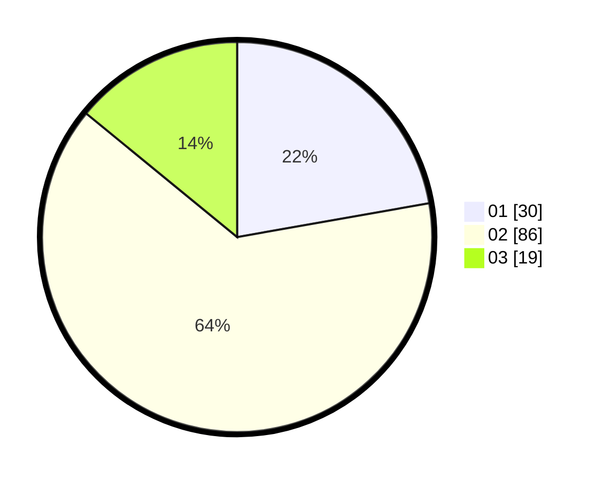

# Hasil

Hasil perolehan suara paslon dapat dilihat pada file paslon-01.txt, paslon-02.txt, dan paslon-03.txt.

Jika tidak ada, artinya data tersebut belum ada pada SIREKAP.

## Perolehan Suara

 * Paslon 01: **30**.
 * Paslon 02: **86**.
 * Paslon 03: **19**.

## Foto C Plano

https://sirekap-obj-formc.kpu.go.id/9bb6/pemilu/ppwp/31/73/01/10/05/3173011005383-20240216-133020--767ecf17-ba5e-49b2-88e3-fbdef8512a4a.jpg

https://sirekap-obj-formc.kpu.go.id/9bb6/pemilu/ppwp/31/73/01/10/05/3173011005383-20240216-133021--e6d251eb-12ed-4aee-88f4-c7bc29a2f49a.jpg

https://sirekap-obj-formc.kpu.go.id/9bb6/pemilu/ppwp/31/73/01/10/05/3173011005383-20240216-133020--8f285a14-0c98-4b60-9d24-05b9e15d128f.jpg

## DATA PEMILIH TETAP

Jumlah pemilih dalam DPT: **171**.
 * L: **85**.
 * P: **86**.

## DATA PENGGUNA HAK PILIH

Jumlah pengguna hak pilih dalam DPT: **136**.
 * L: **68**.
 * P: **68**.

Jumlah pengguna hak pilih dalam DPTb: **0**.
 * L: **0**.
 * P: **0**.

Jumlah pengguna hak pilih dalam DPK: **0**.
 * L: **0**.
 * P: **0**.

Jumlah pengguna hak pilih: **136**.
 * L: **68**.
 * P: **68**.

## JUMLAH SUARA SAH DAN TIDAK SAH

JUMLAH SELURUH SUARA SAH: **135**.

JUMLAH SUARA TIDAK SAH: **1**.

JUMLAH SELURUH SUARA SAH DAN SUARA TIDAK SAH: **136**.
