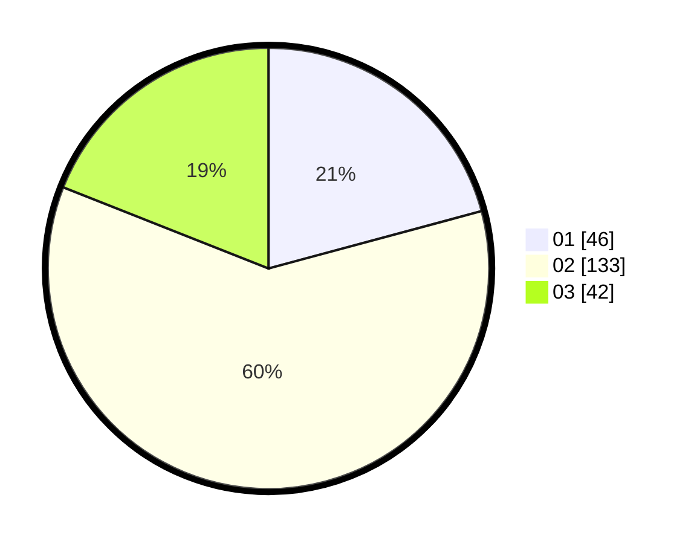

# Hasil

Hasil perolehan suara paslon dapat dilihat pada file paslon-01.txt, paslon-02.txt, dan paslon-03.txt.

Jika tidak ada, artinya data tersebut belum ada pada SIREKAP.

## Perolehan Suara

 * Paslon 01: **46**.
 * Paslon 02: **133**.
 * Paslon 03: **42**.

## Foto C Plano

https://sirekap-obj-formc.kpu.go.id/2f62/pemilu/ppwp/31/73/01/10/05/3173011005384-20240214-231229--303a14c6-2f3d-4771-8dd8-1d4c43ba2ce1.jpg

https://sirekap-obj-formc.kpu.go.id/2f62/pemilu/ppwp/31/73/01/10/05/3173011005384-20240215-120006--aa2739cb-93b0-4d8c-a09a-591c4ba82b9e.jpg

https://sirekap-obj-formc.kpu.go.id/2f62/pemilu/ppwp/31/73/01/10/05/3173011005384-20240214-231525--848a21ab-6d33-4f78-a59d-5e4c1a4004d6.jpg
