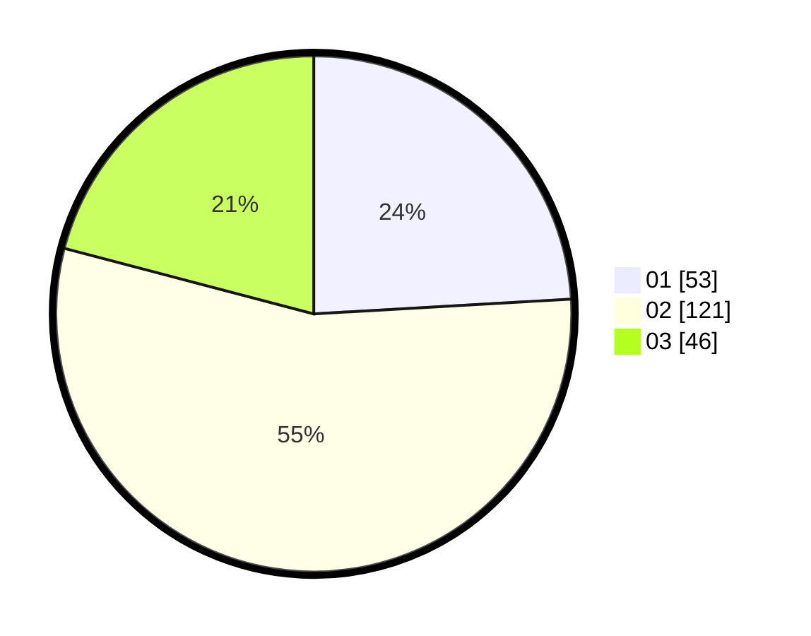

# Hasil

Hasil perolehan suara paslon dapat dilihat pada file paslon-01.txt, paslon-02.txt, dan paslon-03.txt.

Jika tidak ada, artinya data tersebut belum ada pada SIREKAP.

## Perolehan Suara

 * Paslon 01: **53**.
 * Paslon 02: **121**.
 * Paslon 03: **46**.

## Foto C Plano

https://sirekap-obj-formc.kpu.go.id/bbba/pemilu/ppwp/31/73/01/10/05/3173011005385-20240214-162222--c8525b4b-3fa1-4945-bbe9-a9bd3822a674.jpg

https://sirekap-obj-formc.kpu.go.id/bbba/pemilu/ppwp/31/73/01/10/05/3173011005385-20240214-190425--bfc28fce-5743-4514-adba-9fb46557b6de.jpg
