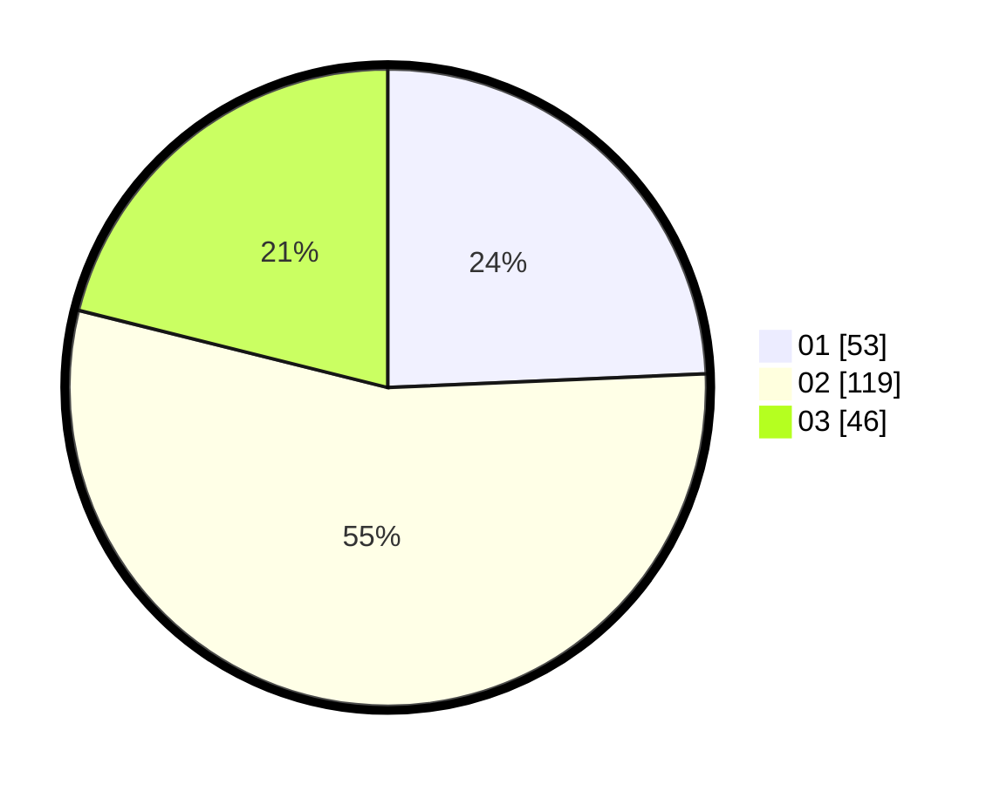

# Hasil

Hasil perolehan suara paslon dapat dilihat pada file paslon-01.txt, paslon-02.txt, dan paslon-03.txt.

Jika tidak ada, artinya data tersebut belum ada pada SIREKAP.

## Perolehan Suara

 * Paslon 01: **53**.
 * Paslon 02: **119**.
 * Paslon 03: **46**.

## Foto C Plano

https://sirekap-obj-formc.kpu.go.id/9616/pemilu/ppwp/31/73/01/10/05/3173011005389-20240215-001206--e7857682-e3d2-4059-acd7-286ede4d40a3.jpg

https://sirekap-obj-formc.kpu.go.id/9616/pemilu/ppwp/31/73/01/10/05/3173011005389-20240214-232203--68efaa14-b4b0-4469-9768-5748ca8c040b.jpg

https://sirekap-obj-formc.kpu.go.id/9616/pemilu/ppwp/31/73/01/10/05/3173011005389-20240214-232527--b8ba4d78-4d9c-4a14-b0a8-38f6a439cab1.jpg
