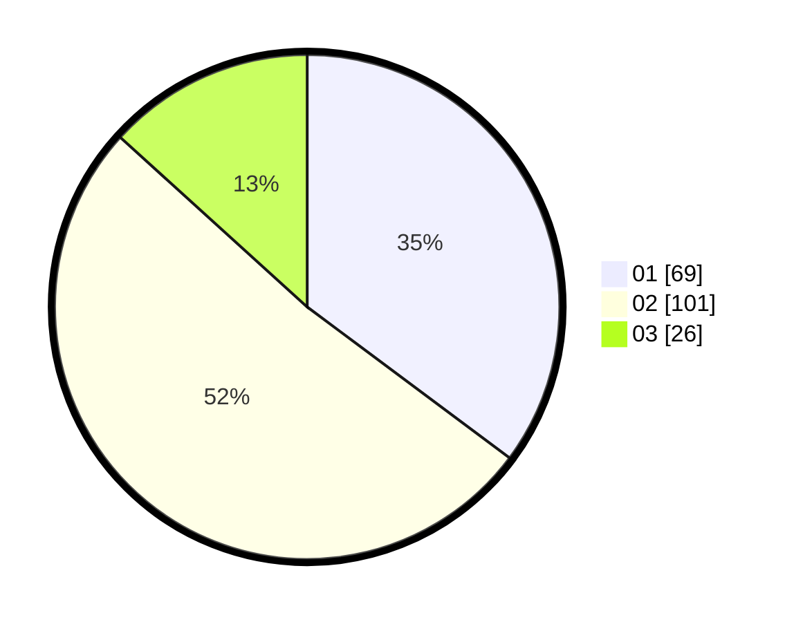

# Hasil

Hasil perolehan suara paslon dapat dilihat pada file paslon-01.txt, paslon-02.txt, dan paslon-03.txt.

Jika tidak ada, artinya data tersebut belum ada pada SIREKAP.

## Perolehan Suara

 * Paslon 01: **69**.
 * Paslon 02: **101**.
 * Paslon 03: **26**.

## Foto C Plano

https://sirekap-obj-formc.kpu.go.id/dcf7/pemilu/ppwp/31/73/01/10/05/3173011005390-20240214-231202--73d815a3-7b39-4716-8d50-33355a134c04.jpg

https://sirekap-obj-formc.kpu.go.id/dcf7/pemilu/ppwp/31/73/01/10/05/3173011005390-20240214-230239--d6d49641-b4bc-4983-82a0-0e3923859f8c.jpg

https://sirekap-obj-formc.kpu.go.id/dcf7/pemilu/ppwp/31/73/01/10/05/3173011005390-20240214-230436--43b4d76c-7a20-4190-916e-96e238b64071.jpg

## DATA PEMILIH TETAP

Jumlah pemilih dalam DPT: **447**.
 * L: **88**.
 * P: **502**.

## DATA PENGGUNA HAK PILIH

Jumlah pengguna hak pilih dalam DPT: **445**.
 * L: **84**.
 * P: **547**.

Jumlah pengguna hak pilih dalam DPTb: **28**.
 * L: **0**.
 * P: **0**.

Jumlah pengguna hak pilih dalam DPK: **22**.
 * L: **46**.
 * P: **5**.

Jumlah pengguna hak pilih: **427**.
 * L: **89**.
 * P: **408**.

## JUMLAH SUARA SAH DAN TIDAK SAH

JUMLAH SELURUH SUARA SAH: **196**.

JUMLAH SUARA TIDAK SAH: **1**.

JUMLAH SELURUH SUARA SAH DAN SUARA TIDAK SAH: **197**.
