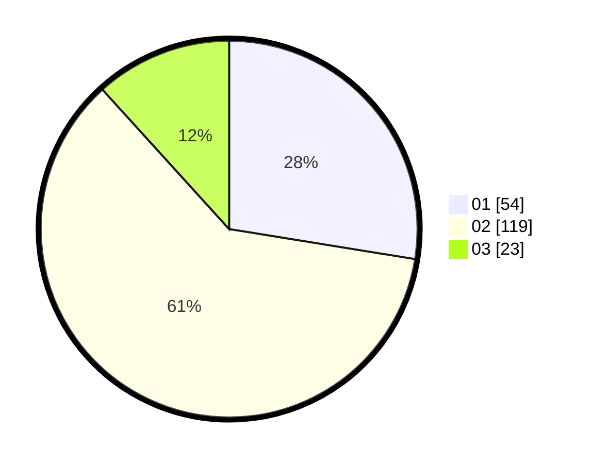

# Hasil

Hasil perolehan suara paslon dapat dilihat pada file paslon-01.txt, paslon-02.txt, dan paslon-03.txt.

Jika tidak ada, artinya data tersebut belum ada pada SIREKAP.

## Perolehan Suara

 * Paslon 01: **54**.
 * Paslon 02: **119**.
 * Paslon 03: **23**.

## Foto C Plano

https://sirekap-obj-formc.kpu.go.id/ece6/pemilu/ppwp/31/73/01/10/05/3173011005392-20240215-014822--f9cf2462-3541-4f7a-9d38-cb9141ed5f5e.jpg

https://sirekap-obj-formc.kpu.go.id/ece6/pemilu/ppwp/31/73/01/10/05/3173011005392-20240215-050148--f7a7714b-d346-477e-9bda-0b621f44434e.jpg

https://sirekap-obj-formc.kpu.go.id/ece6/pemilu/ppwp/31/73/01/10/05/3173011005392-20240215-042655--ff6a45d6-fc24-4a0e-9dc0-0c7d69eefbc3.jpg
