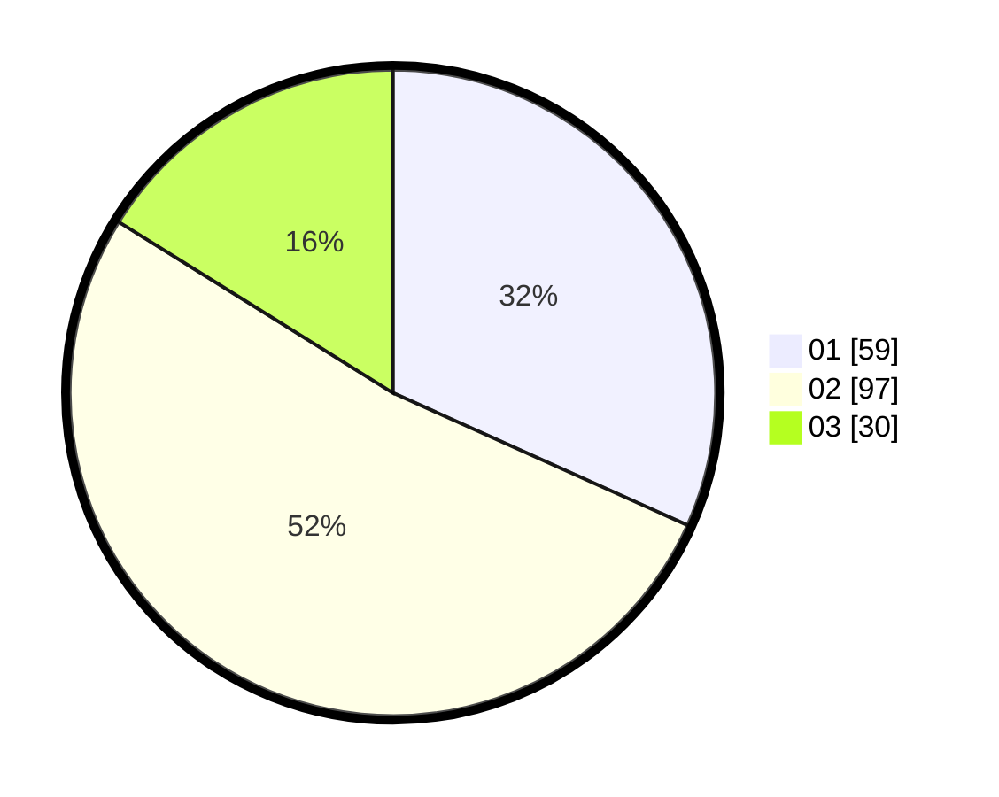

# Hasil

Hasil perolehan suara paslon dapat dilihat pada file paslon-01.txt, paslon-02.txt, dan paslon-03.txt.

Jika tidak ada, artinya data tersebut belum ada pada SIREKAP.

## Perolehan Suara

 * Paslon 01: **59**.
 * Paslon 02: **97**.
 * Paslon 03: **30**.

## Foto C Plano

https://sirekap-obj-formc.kpu.go.id/1567/pemilu/ppwp/31/73/01/10/05/3173011005394-20240214-233824--120baf46-a7c9-4e76-b7a4-2939c9e5f840.jpg

https://sirekap-obj-formc.kpu.go.id/1567/pemilu/ppwp/31/73/01/10/05/3173011005394-20240214-205935--5ceee791-2a7b-47bf-bbb2-81482919fb99.jpg

https://sirekap-obj-formc.kpu.go.id/1567/pemilu/ppwp/31/73/01/10/05/3173011005394-20240214-232625--57f92c9e-b4cd-4978-beac-58afacf96893.jpg
