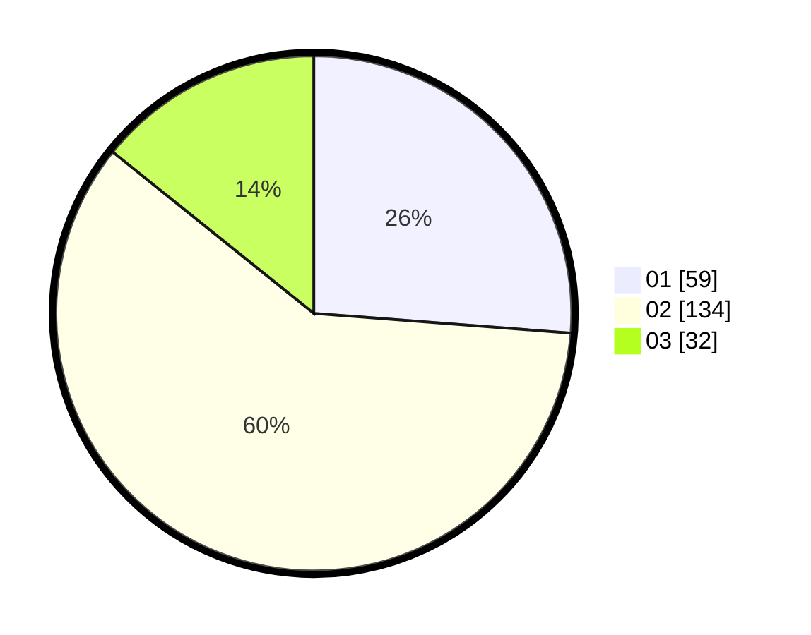

# Hasil

Hasil perolehan suara paslon dapat dilihat pada file paslon-01.txt, paslon-02.txt, dan paslon-03.txt.

Jika tidak ada, artinya data tersebut belum ada pada SIREKAP.

## Perolehan Suara

 * Paslon 01: **59**.
 * Paslon 02: **134**.
 * Paslon 03: **32**.

## Foto C Plano

https://sirekap-obj-formc.kpu.go.id/16b2/pemilu/ppwp/31/73/01/10/05/3173011005396-20240216-132610--deaab213-5614-42f6-b233-fd80514f5535.jpg

https://sirekap-obj-formc.kpu.go.id/16b2/pemilu/ppwp/31/73/01/10/05/3173011005396-20240215-013223--86a74495-2c08-4a7d-bd0d-98e76b7f6d7d.jpg

https://sirekap-obj-formc.kpu.go.id/16b2/pemilu/ppwp/31/73/01/10/05/3173011005396-20240215-013445--464cfc5f-55d3-4246-a530-b45fdf237ec5.jpg

## DATA PEMILIH TETAP

Jumlah pemilih dalam DPT: **275**.
 * L: **136**.
 * P: **139**.

## DATA PENGGUNA HAK PILIH

Jumlah pengguna hak pilih dalam DPT: **224**.
 * L: **108**.
 * P: **116**.

Jumlah pengguna hak pilih dalam DPTb: **0**.
 * L: **0**.
 * P: **0**.

Jumlah pengguna hak pilih dalam DPK: **4**.
 * L: **1**.
 * P: **3**.

Jumlah pengguna hak pilih: **228**.
 * L: **109**.
 * P: **119**.

## JUMLAH SUARA SAH DAN TIDAK SAH

JUMLAH SELURUH SUARA SAH: **225**.

JUMLAH SUARA TIDAK SAH: **3**.

JUMLAH SELURUH SUARA SAH DAN SUARA TIDAK SAH: **228**.
