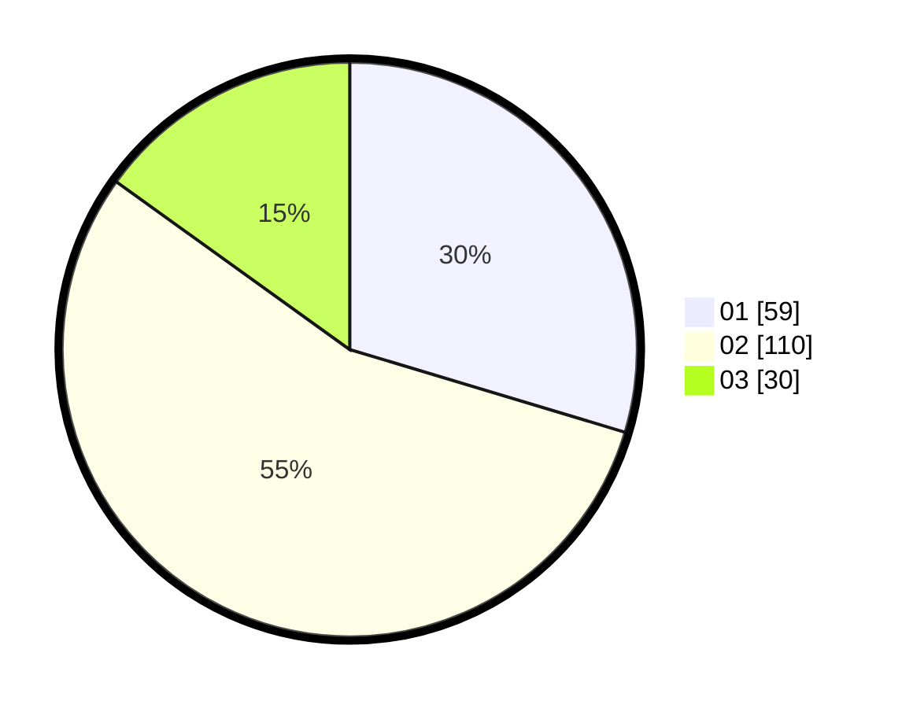

# Hasil

Hasil perolehan suara paslon dapat dilihat pada file paslon-01.txt, paslon-02.txt, dan paslon-03.txt.

Jika tidak ada, artinya data tersebut belum ada pada SIREKAP.

## Perolehan Suara

 * Paslon 01: **59**.
 * Paslon 02: **110**.
 * Paslon 03: **30**.

## Foto C Plano

https://sirekap-obj-formc.kpu.go.id/30ec/pemilu/ppwp/31/73/01/10/05/3173011005398-20240214-224621--b6a794c9-da4b-4835-a616-b529e1d976d9.jpg

https://sirekap-obj-formc.kpu.go.id/30ec/pemilu/ppwp/31/73/01/10/05/3173011005398-20240214-224751--0897c901-bc3c-4807-8ed8-f690a7771fb8.jpg

https://sirekap-obj-formc.kpu.go.id/30ec/pemilu/ppwp/31/73/01/10/05/3173011005398-20240214-224905--39d9887d-50ec-448d-9346-e2922d47d919.jpg

## DATA PEMILIH TETAP

Jumlah pemilih dalam DPT: **269**.
 * L: **138**.
 * P: **131**.

## DATA PENGGUNA HAK PILIH

Jumlah pengguna hak pilih dalam DPT: **193**.
 * L: **90**.
 * P: **103**.

Jumlah pengguna hak pilih dalam DPTb: **1**.
 * L: **1**.
 * P: **0**.

Jumlah pengguna hak pilih dalam DPK: **5**.
 * L: **3**.
 * P: **2**.

Jumlah pengguna hak pilih: **199**.
 * L: **94**.
 * P: **105**.

## JUMLAH SUARA SAH DAN TIDAK SAH

JUMLAH SELURUH SUARA SAH: **199**.

JUMLAH SUARA TIDAK SAH: **0**.

JUMLAH SELURUH SUARA SAH DAN SUARA TIDAK SAH: **199**.
