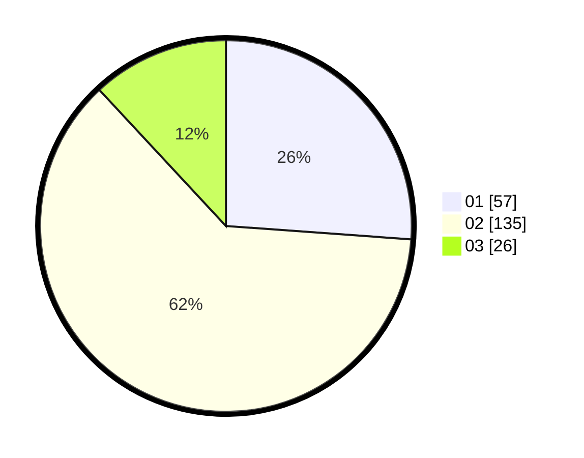

# Hasil

Hasil perolehan suara paslon dapat dilihat pada file paslon-01.txt, paslon-02.txt, dan paslon-03.txt.

Jika tidak ada, artinya data tersebut belum ada pada SIREKAP.

## Perolehan Suara

 * Paslon 01: **57**.
 * Paslon 02: **135**.
 * Paslon 03: **26**.

## Foto C Plano

https://sirekap-obj-formc.kpu.go.id/7b5f/pemilu/ppwp/31/73/01/10/05/3173011005401-20240214-225712--0a760027-e7f5-47c2-83aa-c75e8b981757.jpg

https://sirekap-obj-formc.kpu.go.id/7b5f/pemilu/ppwp/31/73/01/10/05/3173011005401-20240214-230010--7320cdae-7edc-451f-962d-6883ff20d74d.jpg

https://sirekap-obj-formc.kpu.go.id/7b5f/pemilu/ppwp/31/73/01/10/05/3173011005401-20240214-230200--b4ea5604-8d33-46da-9279-ede732e30369.jpg
