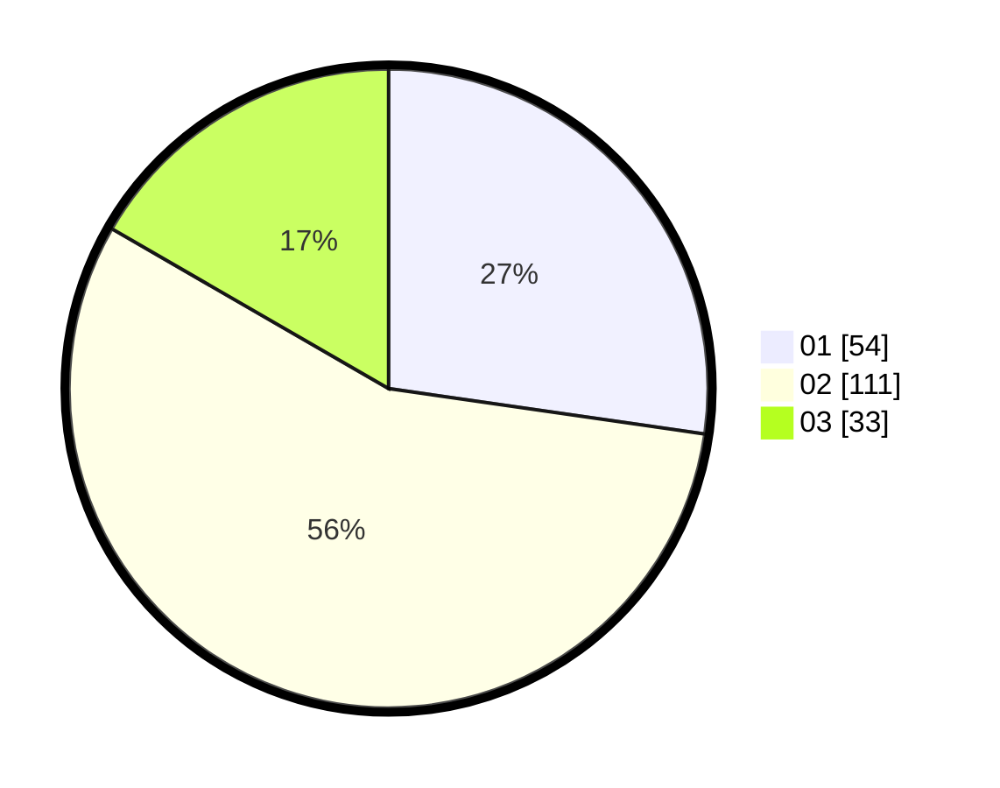

# Hasil

Hasil perolehan suara paslon dapat dilihat pada file paslon-01.txt, paslon-02.txt, dan paslon-03.txt.

Jika tidak ada, artinya data tersebut belum ada pada SIREKAP.

## Perolehan Suara

 * Paslon 01: **54**.
 * Paslon 02: **111**.
 * Paslon 03: **33**.

## Foto C Plano

https://sirekap-obj-formc.kpu.go.id/ce4f/pemilu/ppwp/31/73/01/10/05/3173011005403-20240214-232053--202b7432-7ea4-46e5-bc04-ac6d3f7f061e.jpg

https://sirekap-obj-formc.kpu.go.id/ce4f/pemilu/ppwp/31/73/01/10/05/3173011005403-20240214-232214--090325d9-aa22-4e4e-afc4-4730fdf83240.jpg

https://sirekap-obj-formc.kpu.go.id/ce4f/pemilu/ppwp/31/73/01/10/05/3173011005403-20240214-232335--1a17deca-dc8e-477d-9691-8e58eaeb82a6.jpg
