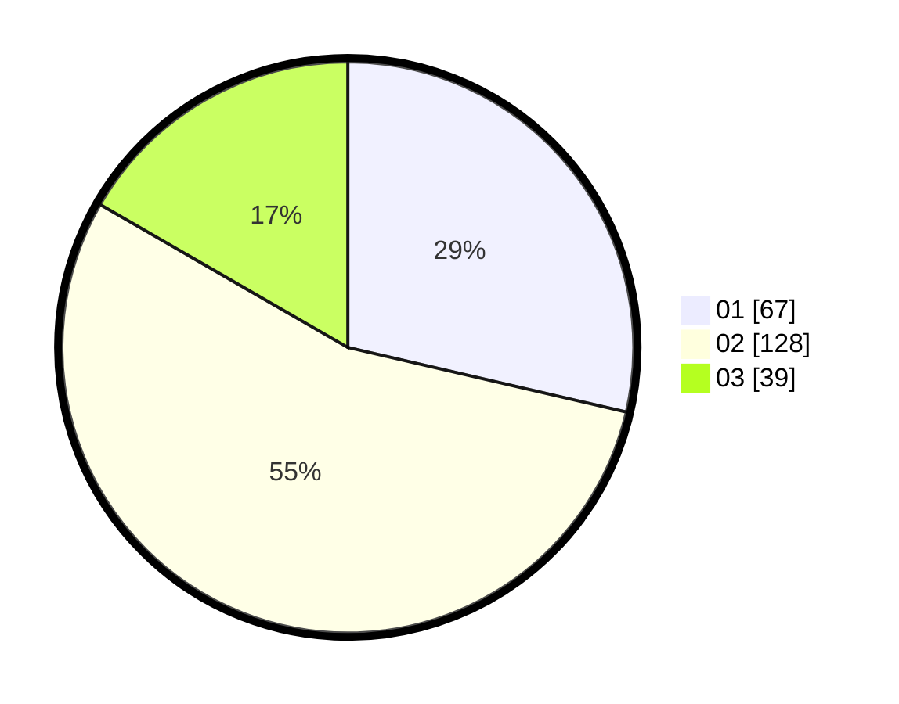

# Hasil

Hasil perolehan suara paslon dapat dilihat pada file paslon-01.txt, paslon-02.txt, dan paslon-03.txt.

Jika tidak ada, artinya data tersebut belum ada pada SIREKAP.

## Perolehan Suara

 * Paslon 01: **67**.
 * Paslon 02: **128**.
 * Paslon 03: **39**.

## Foto C Plano

https://sirekap-obj-formc.kpu.go.id/70b7/pemilu/ppwp/31/73/01/10/05/3173011005410-20240214-192033--34526d8f-f96b-459c-a587-025b401bf0ca.jpg

https://sirekap-obj-formc.kpu.go.id/70b7/pemilu/ppwp/31/73/01/10/05/3173011005410-20240216-055029--226d0ee4-f54e-443e-8c47-b20eb6b0fbc7.jpg

https://sirekap-obj-formc.kpu.go.id/70b7/pemilu/ppwp/31/73/01/10/05/3173011005410-20240214-195722--f1f38ae0-9ab7-470e-bd80-6d181ac3789b.jpg

## DATA PEMILIH TETAP

Jumlah pemilih dalam DPT: **235**.
 * L: **120**.
 * P: **115**.

## DATA PENGGUNA HAK PILIH

Jumlah pengguna hak pilih dalam DPT: **229**.
 * L: **115**.
 * P: **114**.

Jumlah pengguna hak pilih dalam DPTb: **6**.
 * L: **5**.
 * P: **1**.

Jumlah pengguna hak pilih dalam DPK: **0**.
 * L: **0**.
 * P: **0**.

Jumlah pengguna hak pilih: **235**.
 * L: **120**.
 * P: **115**.

## JUMLAH SUARA SAH DAN TIDAK SAH

JUMLAH SELURUH SUARA SAH: **234**.

JUMLAH SUARA TIDAK SAH: **1**.

JUMLAH SELURUH SUARA SAH DAN SUARA TIDAK SAH: **235**.
