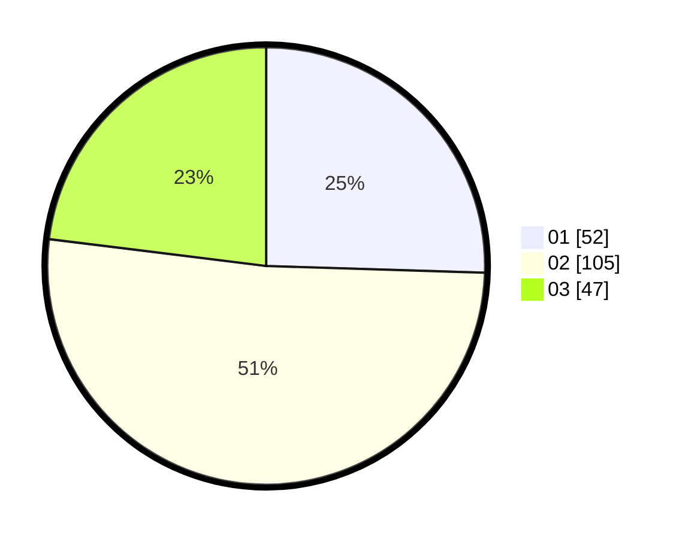

# Hasil

Hasil perolehan suara paslon dapat dilihat pada file paslon-01.txt, paslon-02.txt, dan paslon-03.txt.

Jika tidak ada, artinya data tersebut belum ada pada SIREKAP.

## Perolehan Suara

 * Paslon 01: **52**.
 * Paslon 02: **105**.
 * Paslon 03: **47**.

## Foto C Plano

https://sirekap-obj-formc.kpu.go.id/35c5/pemilu/ppwp/31/73/01/10/05/3173011005413-20240214-234730--56ec8168-79ba-45c5-b0dc-2d2ab43ce703.jpg

https://sirekap-obj-formc.kpu.go.id/35c5/pemilu/ppwp/31/73/01/10/05/3173011005413-20240214-234855--b422ccf2-46e0-454b-a2c0-58db2e8ea59e.jpg

https://sirekap-obj-formc.kpu.go.id/35c5/pemilu/ppwp/31/73/01/10/05/3173011005413-20240214-234938--2374fb6a-1582-4648-883f-48698806c7c8.jpg
