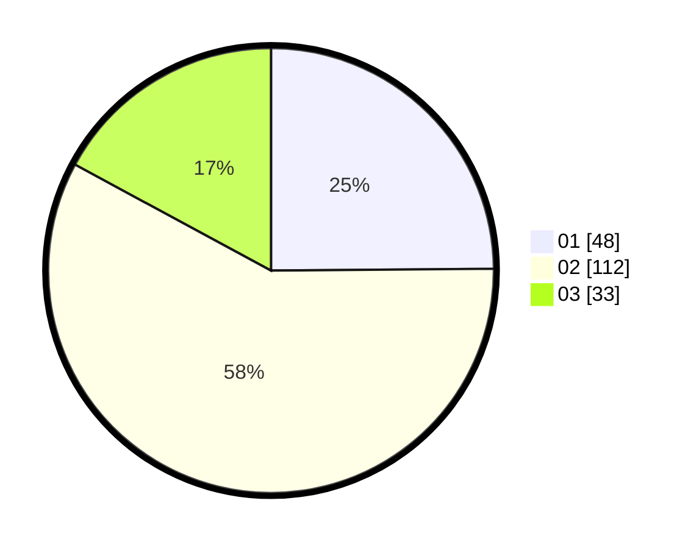

# Hasil

Hasil perolehan suara paslon dapat dilihat pada file paslon-01.txt, paslon-02.txt, dan paslon-03.txt.

Jika tidak ada, artinya data tersebut belum ada pada SIREKAP.

## Perolehan Suara

 * Paslon 01: **48**.
 * Paslon 02: **112**.
 * Paslon 03: **33**.

## Foto C Plano

https://sirekap-obj-formc.kpu.go.id/ff1b/pemilu/ppwp/31/73/01/10/05/3173011005421-20240214-235941--d4478035-2cb4-401e-84cb-196717cf0016.jpg

https://sirekap-obj-formc.kpu.go.id/ff1b/pemilu/ppwp/31/73/01/10/05/3173011005421-20240215-000055--70e379cd-c6a9-4a04-b3d0-16be6c3d2fbc.jpg

https://sirekap-obj-formc.kpu.go.id/ff1b/pemilu/ppwp/31/73/01/10/05/3173011005421-20240215-000213--21896004-ca0f-40b5-bfb2-052c89ed7e71.jpg
