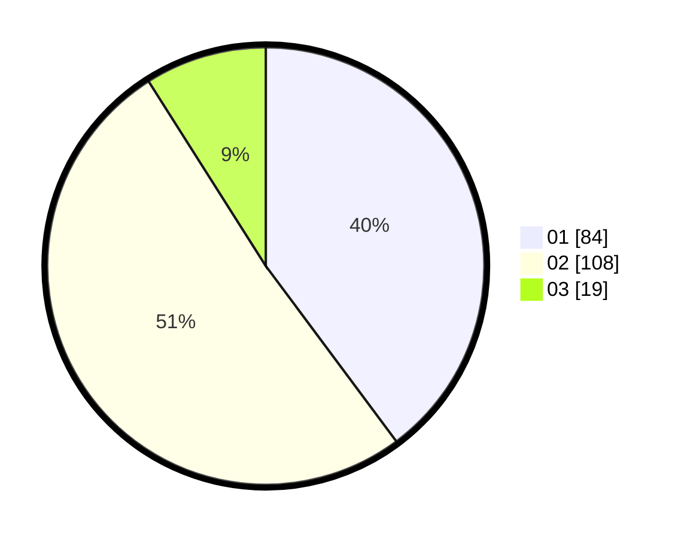

# Hasil

Hasil perolehan suara paslon dapat dilihat pada file paslon-01.txt, paslon-02.txt, dan paslon-03.txt.

Jika tidak ada, artinya data tersebut belum ada pada SIREKAP.

## Perolehan Suara

 * Paslon 01: **84**.
 * Paslon 02: **108**.
 * Paslon 03: **19**.

## Foto C Plano

https://sirekap-obj-formc.kpu.go.id/f747/pemilu/ppwp/31/73/01/10/05/3173011005427-20240215-003857--419fdddb-6f3d-40ce-af0d-2fcd9d4858c9.jpg

https://sirekap-obj-formc.kpu.go.id/f747/pemilu/ppwp/31/73/01/10/05/3173011005427-20240215-025032--75befcae-b756-4bc5-958f-9fae930f1d87.jpg

https://sirekap-obj-formc.kpu.go.id/f747/pemilu/ppwp/31/73/01/10/05/3173011005427-20240215-004001--46a1d5ba-c145-4aa0-a708-dc5b0f5e01fc.jpg
