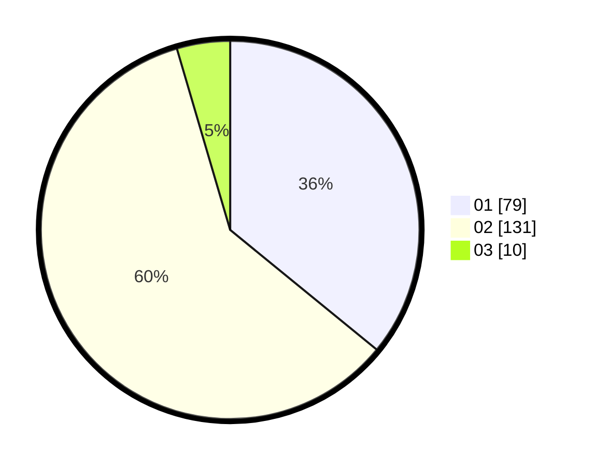

# Hasil

Hasil perolehan suara paslon dapat dilihat pada file paslon-01.txt, paslon-02.txt, dan paslon-03.txt.

Jika tidak ada, artinya data tersebut belum ada pada SIREKAP.

## Perolehan Suara

 * Paslon 01: **79**.
 * Paslon 02: **131**.
 * Paslon 03: **10**.

## Foto C Plano

https://sirekap-obj-formc.kpu.go.id/632b/pemilu/ppwp/31/73/01/10/05/3173011005428-20240215-072906--3f2f3e23-6f43-4c0e-852e-7c6c3226023e.jpg

https://sirekap-obj-formc.kpu.go.id/632b/pemilu/ppwp/31/73/01/10/05/3173011005428-20240215-073040--202a5bc5-fad9-4f56-8da6-e33586480ad2.jpg

https://sirekap-obj-formc.kpu.go.id/632b/pemilu/ppwp/31/73/01/10/05/3173011005428-20240215-073129--e5c72e8a-4843-4729-b59a-1a9a5015726b.jpg
