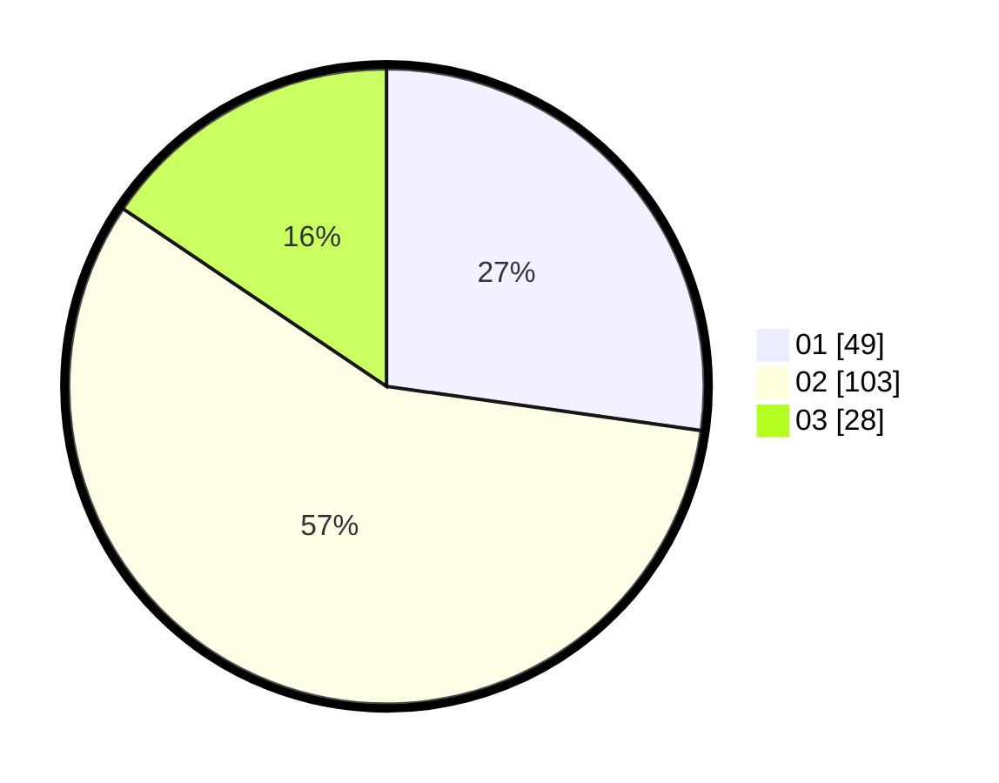

# Hasil

Hasil perolehan suara paslon dapat dilihat pada file paslon-01.txt, paslon-02.txt, dan paslon-03.txt.

Jika tidak ada, artinya data tersebut belum ada pada SIREKAP.

## Perolehan Suara

 * Paslon 01: **49**.
 * Paslon 02: **103**.
 * Paslon 03: **28**.

## Foto C Plano

https://sirekap-obj-formc.kpu.go.id/e11c/pemilu/ppwp/31/73/01/10/05/3173011005433-20240214-155630--d684b14b-8edc-40a5-bfcd-78195a9e9202.jpg

https://sirekap-obj-formc.kpu.go.id/e11c/pemilu/ppwp/31/73/01/10/05/3173011005433-20240215-015910--486d6c61-b2b8-44e3-aef4-4a904f4ab771.jpg

https://sirekap-obj-formc.kpu.go.id/e11c/pemilu/ppwp/31/73/01/10/05/3173011005433-20240214-155458--dcd4e04f-8684-471b-aea7-4b3e19b50037.jpg

## DATA PEMILIH TETAP

Jumlah pemilih dalam DPT: **279**.
 * L: **141**.
 * P: **138**.

## DATA PENGGUNA HAK PILIH

Jumlah pengguna hak pilih dalam DPT: **183**.
 * L: **87**.
 * P: **96**.

Jumlah pengguna hak pilih dalam DPTb: **0**.
 * L: **0**.
 * P: **0**.

Jumlah pengguna hak pilih dalam DPK: **2**.
 * L: **1**.
 * P: **1**.

Jumlah pengguna hak pilih: **185**.
 * L: **88**.
 * P: **97**.

## JUMLAH SUARA SAH DAN TIDAK SAH

JUMLAH SELURUH SUARA SAH: **180**.

JUMLAH SUARA TIDAK SAH: **5**.

JUMLAH SELURUH SUARA SAH DAN SUARA TIDAK SAH: **185**.
