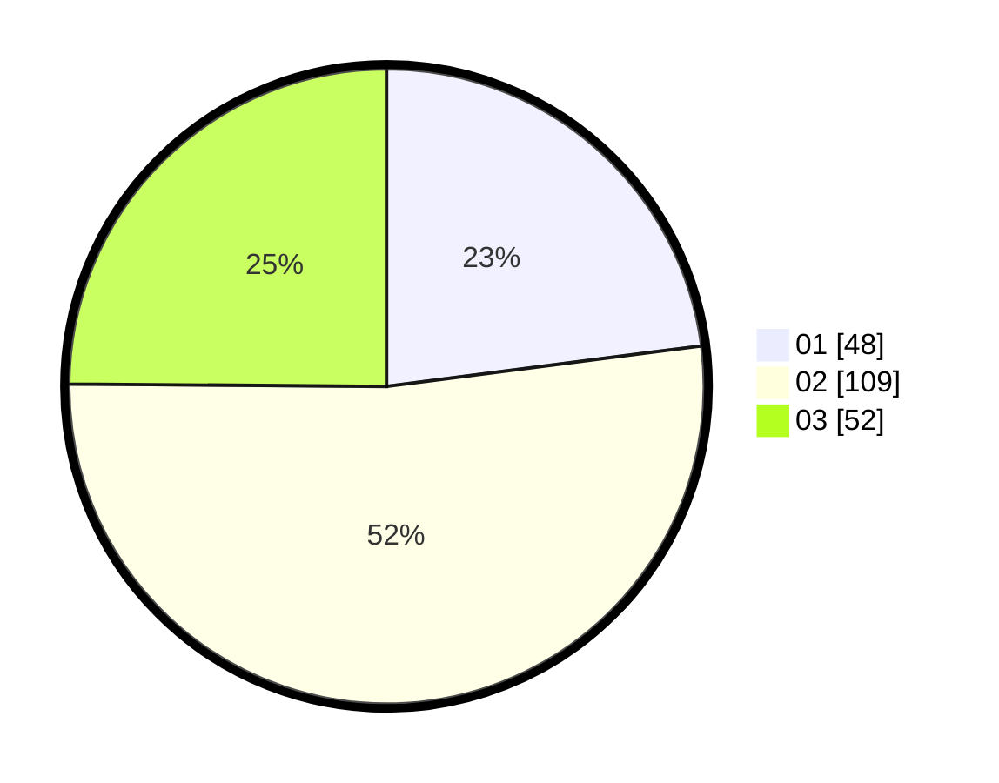

# Hasil

Hasil perolehan suara paslon dapat dilihat pada file paslon-01.txt, paslon-02.txt, dan paslon-03.txt.

Jika tidak ada, artinya data tersebut belum ada pada SIREKAP.

## Perolehan Suara

 * Paslon 01: **48**.
 * Paslon 02: **109**.
 * Paslon 03: **52**.

## Foto C Plano

https://sirekap-obj-formc.kpu.go.id/c115/pemilu/ppwp/31/73/01/10/05/3173011005434-20240216-165921--9f5f295a-d320-4e28-a4a7-793ffec2e216.jpg

https://sirekap-obj-formc.kpu.go.id/c115/pemilu/ppwp/31/73/01/10/05/3173011005434-20240216-165923--00489984-3f54-452b-ad32-ebfe933dc57d.jpg

https://sirekap-obj-formc.kpu.go.id/c115/pemilu/ppwp/31/73/01/10/05/3173011005434-20240216-165922--06c4875c-347b-4286-89f5-e47398a018da.jpg

## DATA PEMILIH TETAP

Jumlah pemilih dalam DPT: **287**.
 * L: **150**.
 * P: **137**.

## DATA PENGGUNA HAK PILIH

Jumlah pengguna hak pilih dalam DPT: **212**.
 * L: **106**.
 * P: **106**.

Jumlah pengguna hak pilih dalam DPTb: **0**.
 * L: **0**.
 * P: **0**.

Jumlah pengguna hak pilih dalam DPK: **0**.
 * L: **0**.
 * P: **0**.

Jumlah pengguna hak pilih: **212**.
 * L: **106**.
 * P: **106**.

## JUMLAH SUARA SAH DAN TIDAK SAH

JUMLAH SELURUH SUARA SAH: **209**.

JUMLAH SUARA TIDAK SAH: **3**.

JUMLAH SELURUH SUARA SAH DAN SUARA TIDAK SAH: **212**.
