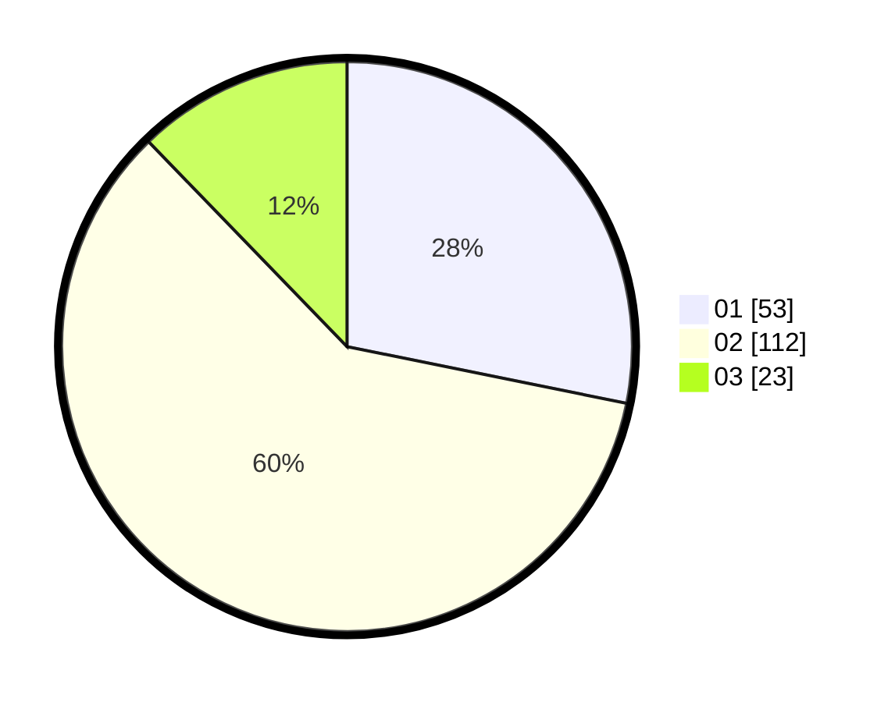

# Hasil

Hasil perolehan suara paslon dapat dilihat pada file paslon-01.txt, paslon-02.txt, dan paslon-03.txt.

Jika tidak ada, artinya data tersebut belum ada pada SIREKAP.

## Perolehan Suara

 * Paslon 01: **53**.
 * Paslon 02: **112**.
 * Paslon 03: **23**.

## Foto C Plano

https://sirekap-obj-formc.kpu.go.id/d7f8/pemilu/ppwp/31/73/01/10/05/3173011005443-20240214-224617--a5d558f1-44a7-4774-ad6f-fc35a7740b47.jpg

https://sirekap-obj-formc.kpu.go.id/d7f8/pemilu/ppwp/31/73/01/10/05/3173011005443-20240214-224734--831b6f25-0e17-4b93-9d95-1f05254fad74.jpg

https://sirekap-obj-formc.kpu.go.id/d7f8/pemilu/ppwp/31/73/01/10/05/3173011005443-20240214-224840--43a8ab8b-d97b-4392-80b7-f6fe21a72c5a.jpg
