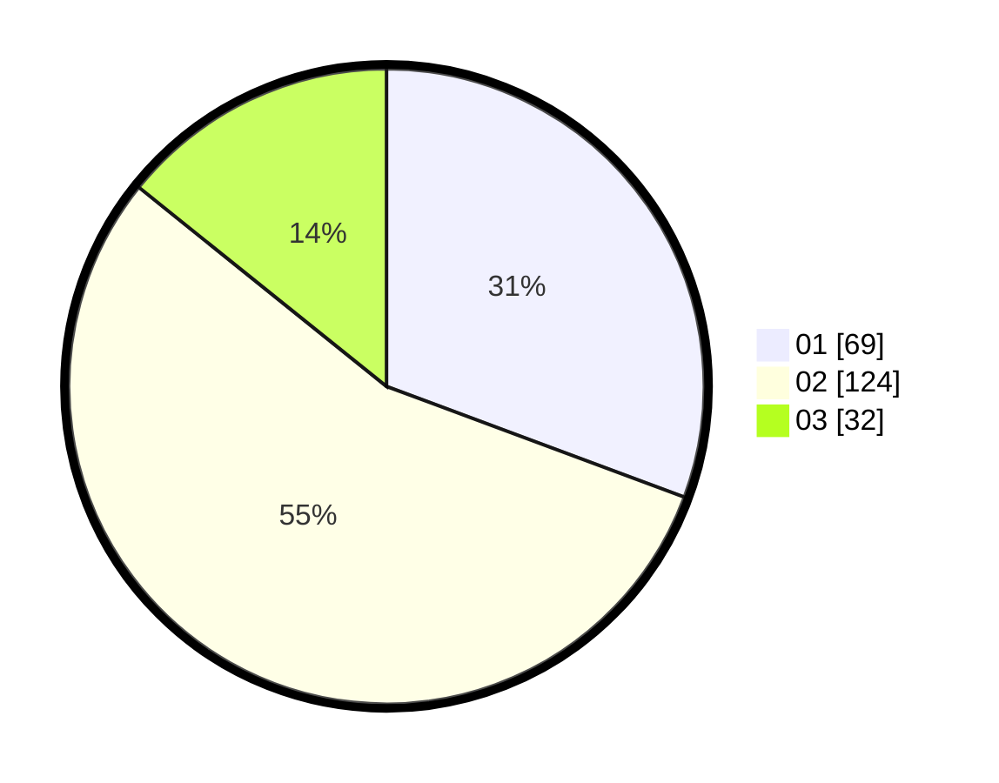

# Hasil

Hasil perolehan suara paslon dapat dilihat pada file paslon-01.txt, paslon-02.txt, dan paslon-03.txt.

Jika tidak ada, artinya data tersebut belum ada pada SIREKAP.

## Perolehan Suara

 * Paslon 01: **69**.
 * Paslon 02: **124**.
 * Paslon 03: **32**.

## Foto C Plano

https://sirekap-obj-formc.kpu.go.id/e1cf/pemilu/ppwp/31/73/01/10/05/3173011005447-20240216-211049--ec775d73-6669-47a8-a202-a9d9cedf1701.jpg

https://sirekap-obj-formc.kpu.go.id/e1cf/pemilu/ppwp/31/73/01/10/05/3173011005447-20240216-211051--a8ed53a7-ff76-4523-8b13-7f17d9d004b1.jpg

https://sirekap-obj-formc.kpu.go.id/e1cf/pemilu/ppwp/31/73/01/10/05/3173011005447-20240216-211050--b4c93062-bce9-4eba-9de3-efce36642d9a.jpg

## DATA PEMILIH TETAP

Jumlah pemilih dalam DPT: **281**.
 * L: **143**.
 * P: **138**.

## DATA PENGGUNA HAK PILIH

Jumlah pengguna hak pilih dalam DPT: **229**.
 * L: **112**.
 * P: **117**.

Jumlah pengguna hak pilih dalam DPTb: **0**.
 * L: **0**.
 * P: **0**.

Jumlah pengguna hak pilih dalam DPK: **0**.
 * L: **0**.
 * P: **0**.

Jumlah pengguna hak pilih: **0**.
 * L: **0**.
 * P: **0**.

## JUMLAH SUARA SAH DAN TIDAK SAH

JUMLAH SELURUH SUARA SAH: **225**.

JUMLAH SUARA TIDAK SAH: **4**.

JUMLAH SELURUH SUARA SAH DAN SUARA TIDAK SAH: **229**.
