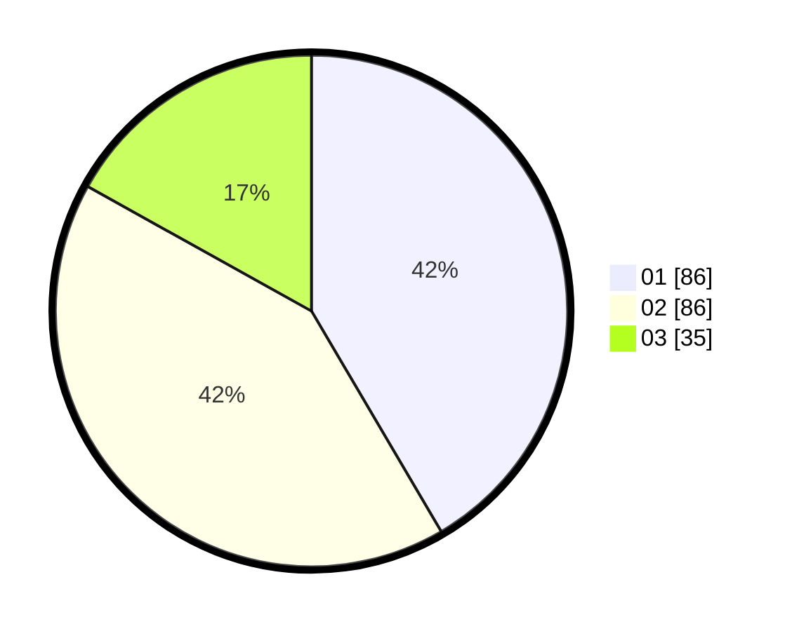

# Hasil

Hasil perolehan suara paslon dapat dilihat pada file paslon-01.txt, paslon-02.txt, dan paslon-03.txt.

Jika tidak ada, artinya data tersebut belum ada pada SIREKAP.

## Perolehan Suara

 * Paslon 01: **86**.
 * Paslon 02: **86**.
 * Paslon 03: **35**.

## Foto C Plano

https://sirekap-obj-formc.kpu.go.id/2bb7/pemilu/ppwp/31/73/01/10/06/3173011006009-20240214-212420--9b7c99e9-1089-4825-b2fb-cbd860cedfea.jpg

https://sirekap-obj-formc.kpu.go.id/2bb7/pemilu/ppwp/31/73/01/10/06/3173011006009-20240214-212655--aae4bf72-6d78-45ce-8b1d-757aa9d33b45.jpg

https://sirekap-obj-formc.kpu.go.id/2bb7/pemilu/ppwp/31/73/01/10/06/3173011006009-20240214-212917--9093af6c-a472-412f-add7-713ff13be192.jpg
